# 实验前准备


## 恢复交换机配置
```bash
leaf1 [standalone: master] (config) # configuration jump-start

Configuration wizard

Step 1: Hostname? [leaf1] leaf1
Step 2: Use DHCP on mgmt0 interface? [yes] n
Step 3: Use zeroconf on mgmt0 interface? [no] no
Step 4: Primary IPv4 address and masklen? [0.0.0.0/0] 192.168.20.106
Step 5: Netmask or mask length? [255.255.255.0] 255.255.255.0
Step 6: Default gateway? 192.168.20.254
Step 7: Primary DNS server?
Step 8: Domain name?
Step 9: Enable IPv6? [yes]
Step 10: Enable IPv6 autoconfig (SLAAC) on mgmt0 interface? [no]
Step 11: Enable DHCPv6 on mgmt0 interface? [yes]
Step 12: Update time? [2018/07/26 22:46:49]
Step 13: Enable password hardening? [no]
Step 14: Admin password (Enter to leave unchanged)?
Step 14: Confirm admin password?
Step 15: Monitor password (Enter to leave unchanged)?

You have entered the following information:

   1. Hostname: leaf01
   2. Use DHCP on mgmt0 interface: no
   3. Use zeroconf on mgmt0 interface: no
   4. Primary IPv4 address and masklen: 192.168.20.106/24
   5. Default gateway: 192.168.20.254
   6. Primary DNS server:
   7. Domain name:
   8. Enable IPv6: yes
   9. Enable IPv6 autoconfig (SLAAC) on mgmt0 interface: no
   10. Enable DHCPv6 on mgmt0 interface: yes
   11. Update time: 2018/07/26 22:47:34
   12. Enable password hardening: no
   13. Admin password (Enter to leave unchanged): (unchanged)
   14. Monitor password (Enter to leave unchanged): (unchanged)

To change an answer, enter the step number to return to.
Otherwise hit <enter> to save changes and exit.

Choice:

Configuration changes saved.


```

## 配置交换机
```bash
enable
configure terminal

interface ethernet 1/3
 module-type qsfp-split-4
```


```bash
enable
configure terminal

vlan 40
 exit
interface ethernet 1/3/2
 description Downlink-to-Server04-ens161np0-Rail4
 switchport mode access
 switchport access vlan 40
 mtu 9216
 no shutdown
 exit

interface ethernet 1/3/3
 description Downlink-to-Server05-ens161np1-Rail4
 switchport mode access
 switchport access vlan 40
 mtu 9216
 no shutdown
 exit

write memor
```

## 检查服务器配置
```bash
ip -br addr show ens161np0
ip link show ens161np0 | grep mtu
```
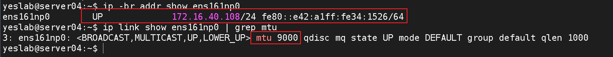

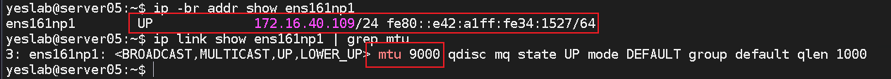

# 实验一：GPU与PCIe拓扑识别
## 查看GPU拓扑
```bash
nvidia-smi topo -m
```
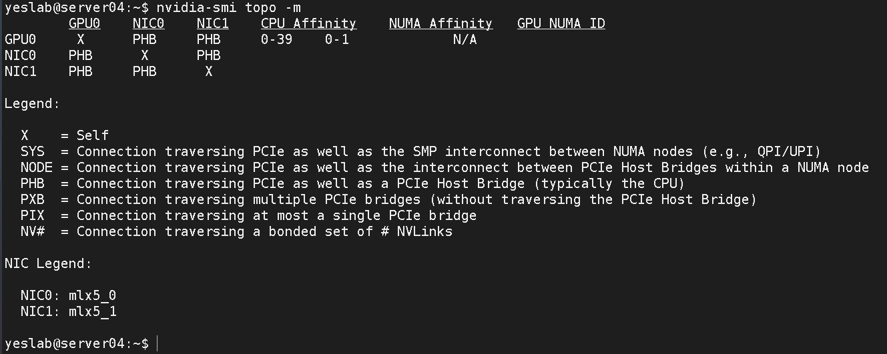

```bash
lspci -tv
# 进一步查看GPU、NIC具体在什么位置
```
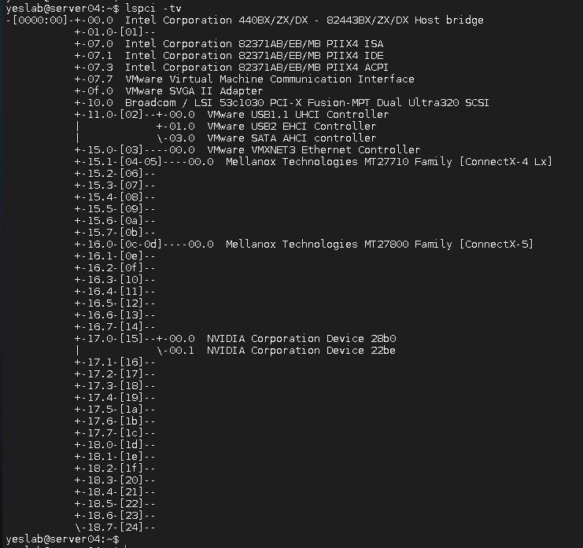

## 查看GPU PCIe信息
```bash
lspci | grep -i nvidia
nvidia-smi -q | grep -i "PCI" -A 25
```
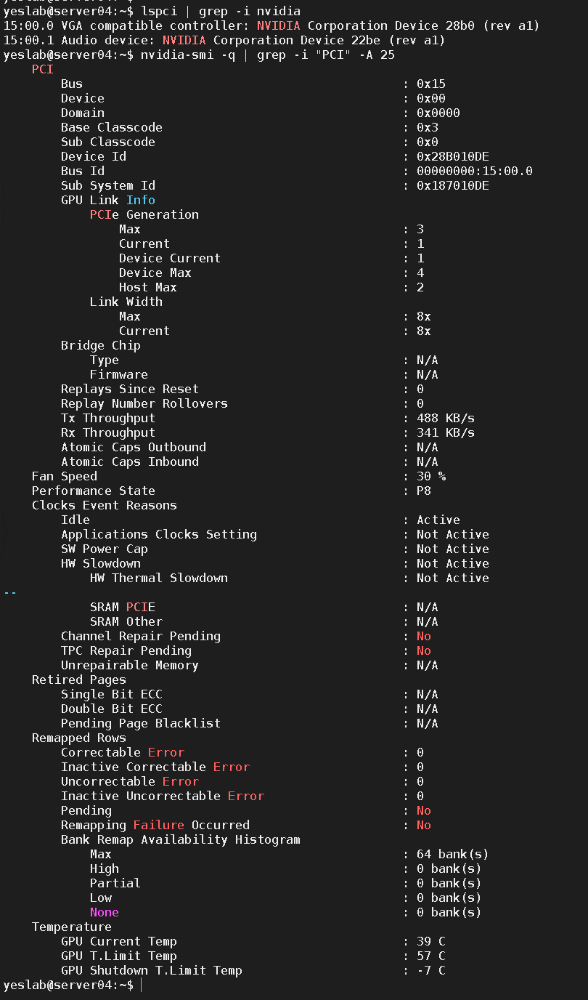

## GPU P2P与带宽测试
```bash
su root
# 切换到root账户
cd /root/cuda-samples-11.5/Samples/bandwidthTest/
# 进入到指定目录

./bandwidthTest
# 执行测试工具
```
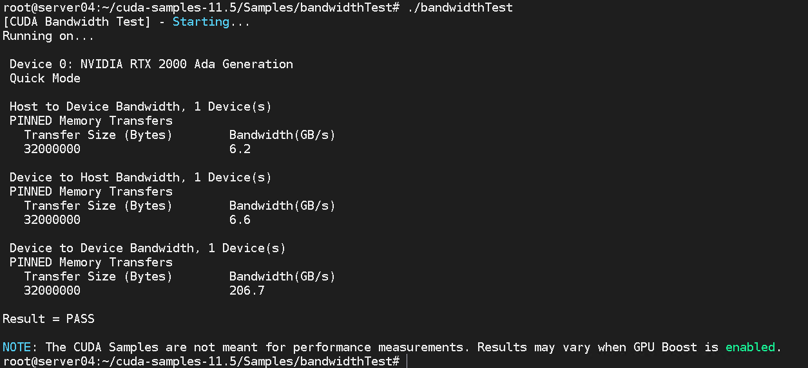

```bash
cd ~
# 回到家目录
./cuda_probe
# 调用CUDA API确认CUDA runtime层面有没有问题
```
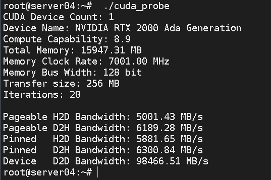


# 实验二：RDMA设备识别
## 查看RDMA设备
```bash
ibv_devices
ibv_devinfo
ibdev2netdev
rdma link show     
```
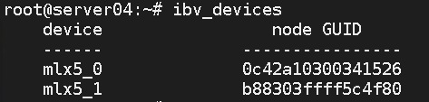
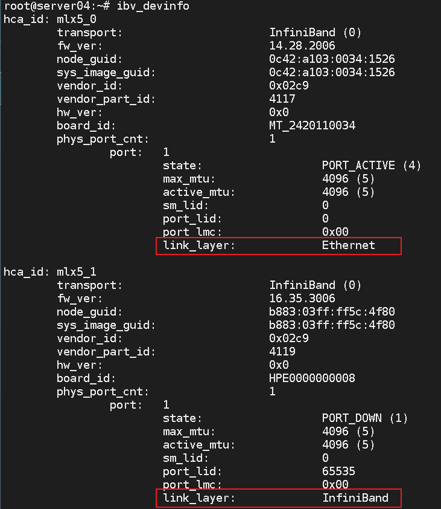
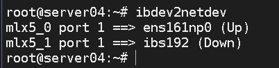


## 确认RoCE GID
```bash
show_gids
```
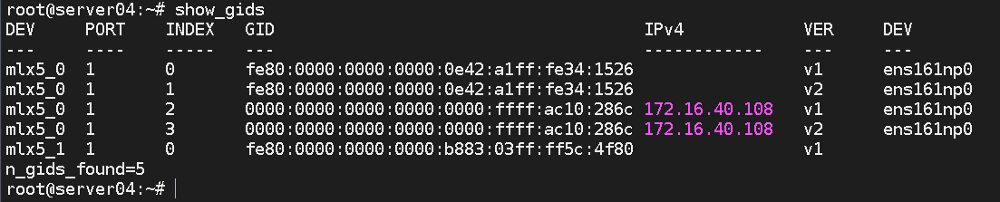

# 实验三：RDMA延迟测试
## Rail 4延迟测试
server05作为服务端（服务端启动）:
```bash
ib_send_lat -d <server05_rail4_rdma_device> -i 1 -x <gid_index>
# 设备名称通过'ibdev2netdev'查看，然后通过'show_gids'查看对应的GID
```
例如:
```bash
ib_send_lat -d mlx5_0 -i 1 -x 3
```
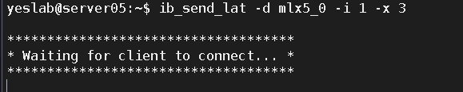

server04作为客户端进行测试:
```bash
ib_send_lat -d <server04_rail4_rdma_device> -i 1 -x <gid_index> <server_ip_address>
# 设备名称通过'ibdev2netdev'查看，然后通过'show_gids'查看对应的GID
```
例如:
```bash
ib_send_lat -d mlx5_0 -i 1 -x 3 172.16.40.109
```
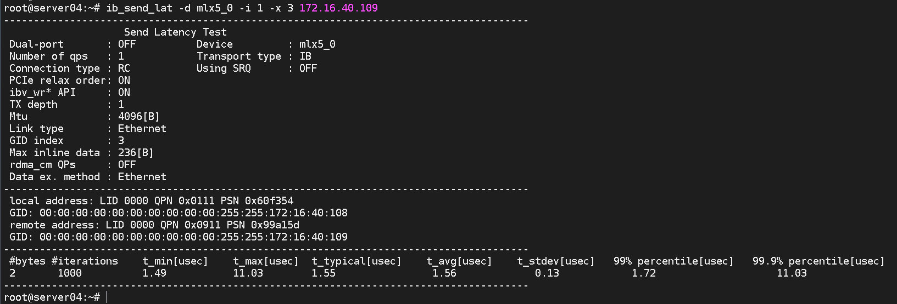
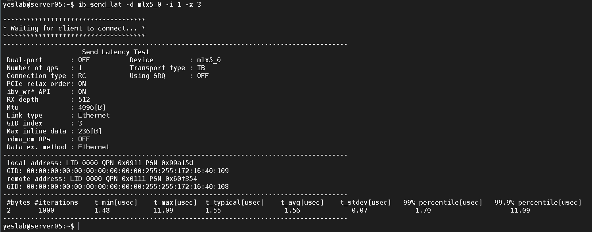

# 实验四：RDMA带宽测试
## Rail 4 单流带宽测试
Server-05
```bash
ib_write_bw -d <server05_rail4_rdma_device> -i 1 -x <gid_index>
# 设备名称通过'ibdev2netdev'查看，然后通过'show_gids'查看对应的GID
```
例如:
```bash
ib_write_bw -d mlx5_0 -i 1 -x 3
```
server05_test_bw

Server-04

