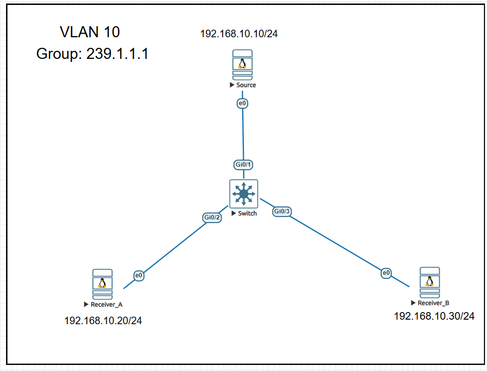
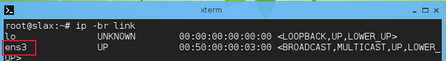
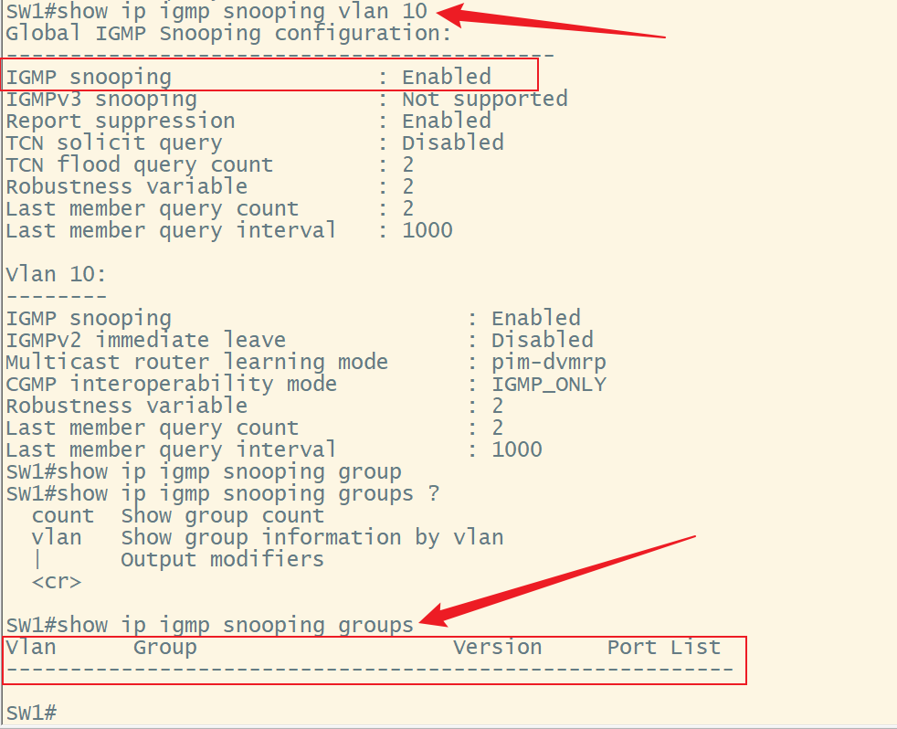
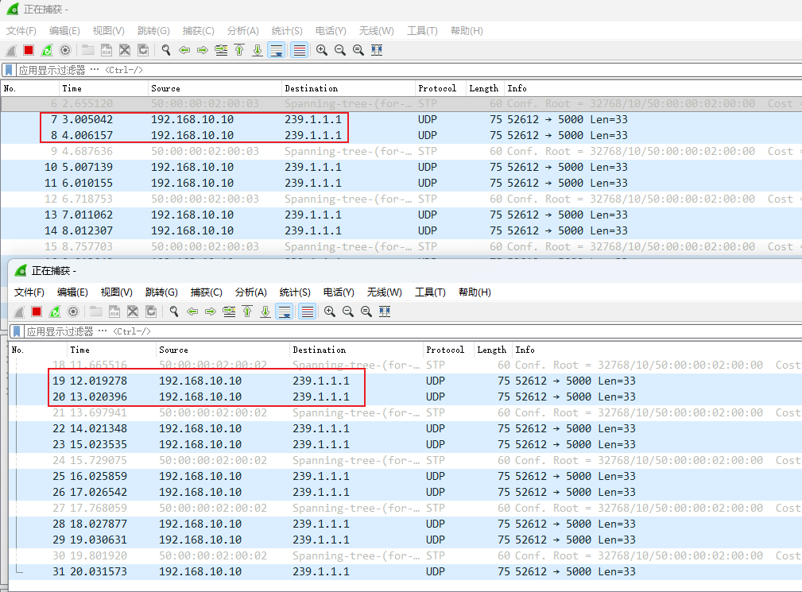
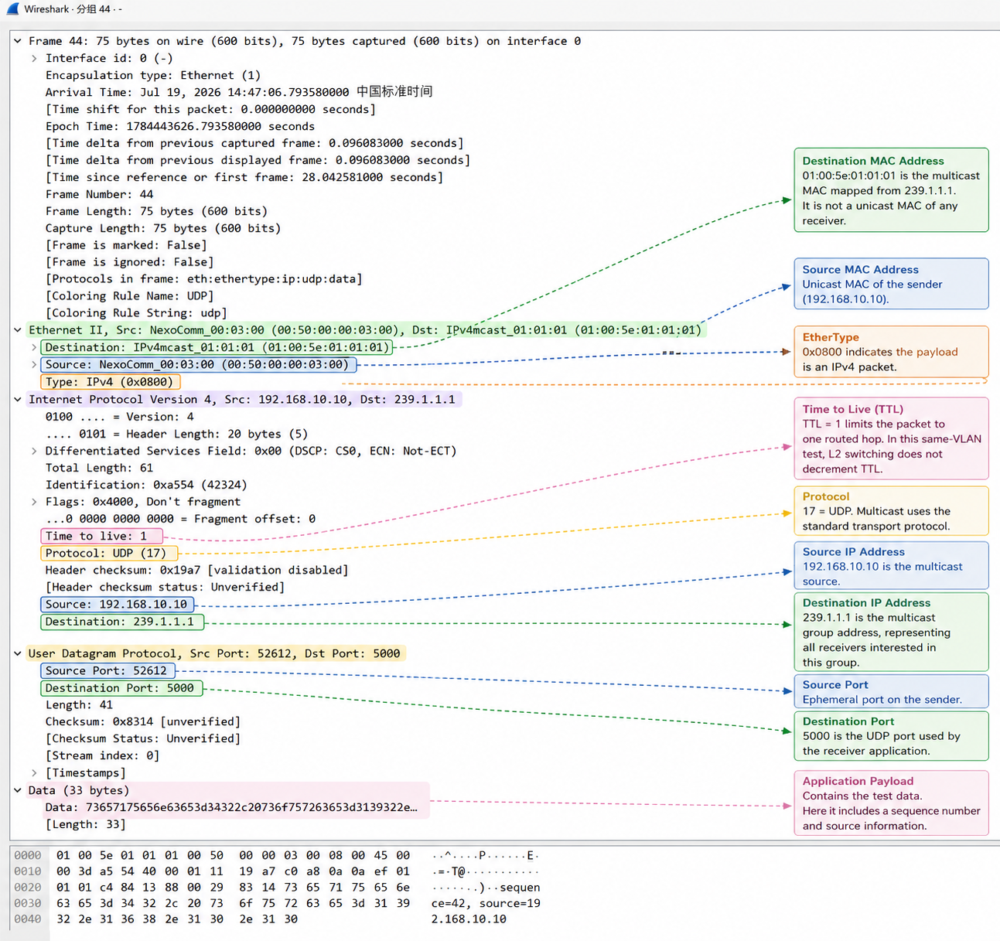

---

status: en-draft
title: Multicast Fundamentals
chapter: 01
tags:
* Multicast
* IGMP
* PIM
* ASM
* SSM

---

# 01 - Multicast Fundamentals

## 1. What Problem Does Multicast Solve?

In a network, the same data can be delivered to multiple receivers through three primary communication models:

* Unicast
* Broadcast
* Multicast

The fundamental differences are who replicates the data, how many copies are created, and which hosts receive them.

### 1.1 Unicast: One-to-One Communication

In unicast communication, every data flow has a specific source address and destination address.

If a server needs to send the same data to 1,000 clients, it normally has to establish or maintain 1,000 independent flows and repeatedly transmit the same data.

```text
                    ┌── Receiver 1
                    ├── Receiver 2
Source ─────────────├── Receiver 3
                    ├── ...
                    └── Receiver 1000
```

As the number of receivers increases, the source generally consumes more resources:

* Egress bandwidth;
* Socket and session resources;
* Data replication overhead;
* TCP or UDP stack processing capacity;
* Application processing capacity.

In large-scale one-to-many scenarios, the source's bandwidth and system overhead generally grow approximately linearly with the number of receivers.

This does not mean that unicast cannot support large-scale data distribution. Modern servers, CDNs, and distributed systems can support large numbers of unicast connections through multithreading, load balancing, and application-layer replication.

However, when many receivers need to continuously receive exactly the same real-time data, unicast may not be the most efficient transport method.

---

### 1.2 Broadcast: One-to-an-Entire-Broadcast-Domain Communication

Broadcast traffic is sent to every host in the same Layer 2 broadcast domain.

```text
Source
   │
   ▼
Switch
   ├── Host A
   ├── Host B
   ├── Host C
   └── Host D
```

Whether or not a host needs the data, a switch normally forwards a broadcast frame out all relevant ports in the broadcast domain.

Broadcast has the following limitations:

* Broadcast traffic normally does not cross routers;
* Every host NIC may receive the broadcast frame;
* Hosts must inspect and process the relevant packets;
* A large broadcast scope can increase network and endpoint load;
* Broadcast is unsuitable for large-scale distribution across Layer 3 networks.

Broadcast is appropriate for LAN control-plane functions such as ARP and DHCP Discovery, but not for large-scale real-time data distribution.

---

### 1.3 Multicast: On-Demand One-to-Many Communication

Multicast allows a source to send one copy of the data to a logical multicast group. Network devices replicate packets only at necessary path-branching points, according to receiver join state.

```text
                         ┌── Receiver A
Source ─── Router ───────┤
                         └── Receiver B
```

The source generally sends only one copy:

```text
Source → Multicast Group G
```

The source does not need to maintain the addresses of all receivers and usually does not know how many receivers currently exist.

Network devices are responsible for:

* Determining which networks contain receivers;
* Building multicast forwarding state;
* Replicating packets at path-branching points;
* Avoiding forwarding in directions that do not need the traffic.

The core value of multicast can be summarized as follows:

> The source sends only one copy of the data. The network replicates packets only where paths branch and forwards the traffic toward networks that contain receivers.

---

## 2. What Does Multicast Not Provide?

Multicast improves the efficiency of one-to-many distribution, but multicast itself is not the same as reliable transport.

IP multicast normally uses a best-effort delivery model. By itself, it does not guarantee that:

* Packets will arrive;
* Packets will not be lost;
* Packets will arrive in transmission order;
* All receivers will experience identical latency;
* All receivers will receive packets at the same time;
* Service will remain uninterrupted during a network failure;
* Lost packets will be retransmitted automatically.

Consequently, applications in environments such as financial market data normally also implement:

* Sequence numbers;
* Gap detection;
* Duplicate detection;
* Packet-reordering handling;
* A retransmission channel;
* Snapshot recovery;
* Feed A/B arbitration.

Multicast improves distribution efficiency; it does not automatically provide reliability or determinism.

---

## 3. Core Roles in Multicast Communication

### 3.1 Source

A source is a host or application that sends multicast traffic.

The source sends data to a multicast group address, for example:

```text
239.1.1.1
```

The source normally does not need to know:

* The receivers' unicast IP addresses;
* The number of receivers;
* Which networks contain the receivers;
* When receivers join or leave.

In most scenarios, the source is only responsible for continuously sending data to the multicast group.

---

### 3.2 Receiver

A receiver is a host or application that wants to receive traffic for a multicast group.

The receiver joins the relevant multicast group through its local operating system or application.

For example:

```text
Join group 239.1.1.1
```

In an SSM environment, a receiver can also specify the source:

```text
Join traffic from source 10.1.1.10
to group 232.1.1.1
```

The corresponding multicast state is written as:

```text
(S,G)
```

Where:

* `S` represents the source;
* `G` represents the multicast group.

---

### 3.3 Multicast Group

A multicast group is a logical channel, not a specific device.

For example:

```text
239.1.1.1
```

Multiple receivers can join the same group at the same time.

```text
Receiver A ─┐
Receiver B ─┼── Join 239.1.1.1
Receiver C ─┘
```

The source sends data to the group rather than separately to every receiver.

---

### 3.4 First-Hop Router

The first-hop router (FHR) is the multicast router directly connected to, or closest to, the source.

It is generally responsible for:

* Receiving multicast traffic from the source;
* Performing multicast forwarding checks;
* Registering the source with the RP in a PIM-SM ASM environment;
* Building or maintaining source-side multicast state.

---

### 3.5 Last-Hop Router

The last-hop router (LHR) is the multicast router directly connected to, or closest to, the receiver.

It is generally responsible for:

* Receiving IGMP Membership Reports from receivers;
* Maintaining local receiver membership state;
* Sending PIM Joins according to receiver demand;
* Forwarding multicast traffic onto the receiver's network.

---

### 3.6 Rendezvous Point

The rendezvous point (RP) is mainly used for source discovery and shared-tree construction in a PIM-SM ASM environment.

Its main functions include:

* Acting as the logical meeting point for the source side and receiver side;
* Receiving PIM Registers sent by the first-hop router;
* Receiving `(*,G)` Joins built from the last-hop-router direction;
* Helping receivers discover unknown sources.

Note:

> The RP does not necessarily remain permanently in the multicast data path.

In PIM-SM ASM, initial traffic may traverse the RP and the shared tree. The last-hop router can subsequently build an `(S,G)` shortest-path tree directly toward the source, allowing data traffic to bypass the RP.

In an SSM environment, the receiver already knows the source, so an RP is not required for source discovery.

---

## 4. Multicast Is a Receiver-Driven Model

Multicast is normally a communication model driven by receiver demand.

A source can continue to send multicast traffic even when no receivers exist.

```text
Source ─── Send traffic to G
```

However, if the network has no receivers and no multicast forwarding state, network devices may not forward the traffic farther downstream.

A receiver expresses its demand through IGMP:

```text
Receiver
   │
   │ IGMP Membership Report
   ▼
Last-Hop Router
```

The last-hop router then uses PIM to build the multicast distribution tree in the upstream direction:

```text
Last-Hop Router
   │
   │ PIM Join
   ▼
Upstream Router
   │
   ▼
RP or Source
```

Multicast can therefore be understood as follows:

> The source sends, the receiver expresses demand, and the network builds a distribution path according to that demand.

---

## 5. Overall Components of the Multicast Control Plane

Multicast is not implemented by a single protocol. It relies on several protocols and mechanisms working together:

* IGMP;
* IGMP Snooping;
* PIM;
* RPF;
* The unicast routing table.

---

### 5.1 IGMP: Group Membership Management Between Hosts and Routers

IGMP manages group membership between receivers and the last-hop router in IPv4 networks.

A receiver uses IGMP to tell its local router:

```text
I want to receive traffic for group G.
```

With IGMPv3, a receiver can also state:

```text
I want to receive traffic from source S for group G.
```

IGMP mainly determines:

* Which receiver wants to join which group;
* When a receiver leaves a group;
* Whether a receiver wants traffic from a specific source;
* Whether any active receivers remain on the local network.

IGMP does not build multicast forwarding paths between routers.

---

### 5.2 IGMP Snooping: On-Demand Layer 2 Forwarding Optimization

An ordinary Layer 2 switch does not terminate IGMP, but it can listen to IGMP messages passing through it.

This process is called:

```text
IGMP Snooping
```

By analyzing IGMP Reports, Leaves, and Queries, the switch learns:

* Which physical ports connect to receivers;
* Which ports need traffic for a given group;
* Which ports connect to multicast routers or the IGMP querier.

The switch can then create a Layer 2 multicast forwarding entry similar to:

```text
Group 239.1.1.1
Outgoing Ports:
- Ethernet1/1
- Ethernet1/3
```

The switch therefore does not need to flood multicast traffic out every port.

Important points:

* IGMP Snooping is a Layer 2 forwarding optimization;
* It does not build multicast trees across routers;
* It depends on IGMP Queries to maintain receiver membership;
* Without a querier, snooping entries may age out;
* Default handling of unknown multicast varies by vendor.

---

### 5.3 PIM: Building Multicast Distribution Trees Between Routers

PIM stands for:

```text
Protocol Independent Multicast
```

PIM is used to build and maintain multicast distribution trees between routers.

PIM mainly determines:

* Which routers have downstream receivers;
* In which upstream direction a PIM Join should be sent;
* Which interfaces should forward multicast traffic;
* When to build `(*,G)` or `(S,G)` state;
* When to prune branches that no longer need traffic;
* How to switch from a shared tree to a shortest-path tree.

PIM does not calculate a complete unicast route by itself.

It relies on the existing unicast routing table to perform RPF checks and determine the upstream direction toward the source or RP.

---

### 5.4 RPF: Reverse-Path Checks in Multicast Forwarding

RPF stands for:

```text
Reverse Path Forwarding
```

When a router receives a multicast packet, it checks whether the packet arrived on the correct reverse-path interface toward the source.

Conceptually, it asks:

```text
Where would I send a unicast packet toward the source?
```

If the unicast routing table says that the best path to the source exits through Interface A, multicast packets returning from that source should normally enter through Interface A.

```text
Unicast route to Source:
Source S via Interface A

Expected multicast incoming interface:
Interface A
```

If the multicast packet arrives on another interface, an RPF failure may occur and the packet will be dropped.

Therefore:

> Multicast routing does not replace unicast routing. PIM and multicast forwarding rely on the unicast routing table to determine the RPF path toward a source or RP.

---

## 6. Control Plane and Data Plane

### 6.1 Control Plane

The multicast control plane builds forwarding state. Its functions include:

* A receiver sending an IGMP Report;
* A switch learning the receiver-facing port through IGMP Snooping;
* The last-hop router maintaining membership;
* Routers sending PIM Join and Prune messages;
* Routers performing RPF lookups;
* Building `(*,G)` or `(S,G)` state;
* Programming multicast state into hardware forwarding tables.

---

### 6.2 Data Plane

The multicast data plane forwards and replicates packets according to existing state.

When a packet enters a router or switch, the device normally checks:

* The incoming interface;
* RPF state;
* The group address;
* The source address;
* The outgoing interface list;
* The hardware multicast forwarding table;
* The replication list.

The device replicates the packet only onto interfaces that require the multicast traffic.

---

## 7. `(*,G)` and `(S,G)` State

### 7.1 `(*,G)`

`(*,G)` means:

```text
Any source sending to group G
```

Where:

* `*` represents any source;
* `G` represents the multicast group.

`(*,G)` is mainly associated with the ASM shared tree.

For example:

```text
(*, 239.1.1.1)
```

This means that the receiver wants traffic sent to `239.1.1.1` by any source.

---

### 7.2 `(S,G)`

`(S,G)` means:

```text
A specific source S sending to group G
```

For example:

```text
(10.1.1.10, 232.1.1.1)
```

This means that only traffic sent by source `10.1.1.10` to group `232.1.1.1` is accepted.

`(S,G)` is commonly used for:

* SPT;
* SSM;
* Source-specific forwarding;
* More precise multicast state and security controls.

---

## 8. Shared Tree and Shortest-Path Tree

### 8.1 Shared Tree

A shared tree uses the RP as its logical root.

```text
Source
   │
   ▼
  RP
   │
   ▼
Receiver
```

The receiver side normally first builds a `(*,G)` Join toward the RP.

Advantages of a shared tree include:

* The receiver does not need to know the source in advance;
* Multiple sources are supported;
* Source discovery is relatively flexible.

Potential disadvantages include:

* Indirect paths;
* RP-related control-plane complexity;
* An additional failure domain;
* More complex troubleshooting.

---

### 8.2 Shortest-Path Tree

A shortest-path tree (SPT) uses the source as its root.

```text
Source
   │
   └──── Shortest RPF Path ──── Receiver
```

An SPT normally uses `(S,G)` state.

Its advantages include:

* A path directed toward the source;
* Data forwarding no longer depends on the shared tree;
* Easier analysis of the source-to-receiver path;
* A design generally better suited to low-latency environments.

However, an SPT still depends on:

* Stable unicast routing;
* RPF calculation;
* PIM neighbors;
* Hardware table programming;
* Receiver membership.

An SPT does not eliminate failure risk.

---

## 9. Overview of ASM and SSM

### 9.1 ASM

ASM stands for:

```text
Any-Source Multicast
```

ASM allows a receiver to join a group without specifying a source in advance.

```text
(*,G)
```

In a PIM-SM ASM environment:

1. The receiver sends an IGMP Report to join the group;
2. The last-hop router sends a `(*,G)` Join toward the RP;
3. The source sends traffic to the group;
4. The first-hop router sends a PIM Register to the RP;
5. The RP builds source state;
6. Initial traffic can reach the receiver through the shared tree;
7. The last-hop router can then build an `(S,G)` SPT;
8. After switching to the SPT, data traffic can bypass the RP.

The RP therefore mainly provides:

* Source discovery;
* The shared-tree root;
* An initial meeting point for sources and receivers.

The RP does not necessarily forward all multicast data permanently.

---

### 9.2 SSM

SSM stands for:

```text
Source-Specific Multicast
```

SSM requires a receiver to explicitly specify the source and group:

```text
(S,G)
```

SSM normally uses the following IPv4 address range:

```text
232.0.0.0/8
```

The receiver normally expresses its `(S,G)` requirement through IGMPv3 source filtering.

A typical SSM flow is:

```text
Receiver
   │ IGMPv3 (S,G) Report
   ▼
Last-Hop Router
   │ PIM (S,G) Join
   ▼
Shortest RPF Path
   │
   ▼
Source
```

SSM does not require an RP for source discovery because the receiver already knows the source address.

SSM reduces:

* RP-related dependencies;
* Shared-tree state;
* Source-discovery complexity;
* Risks introduced by unauthorized or unintended sources;
* Some ASM control-plane failure modes.

However, SSM still depends on:

* IGMPv3 or SSM mapping;
* Unicast routing;
* RPF;
* PIM;
* Multicast hardware resources;
* Source and receiver availability.

---

## 10. Why Is SSM Commonly Used for Financial Market Data?

Financial market data has the following typical characteristics:

* Data is normally sent by known exchanges or market-data servers;
* Source addresses are relatively fixed;
* Receivers must explicitly subscribe to specific feeds;
* Data is normally sent continuously over UDP;
* Latency and packet loss have a significant business impact;
* Unauthorized sources must be strictly restricted;
* Feeds normally have clearly planned groups and ports.

When supported by the equipment and exchange specifications, SSM therefore normally offers the following advantages:

* A receiver can explicitly specify the source;
* No RP is required for source discovery;
* The control plane is more direct;
* State is easier to analyze;
* The risk of traffic from an incorrect source can be reduced;
* Troubleshooting can focus on a specific `(S,G)`;
* Source, group, and receiver mappings are easier to establish.

However, this does not mean that every financial multicast deployment must use SSM.

The actual design still depends on:

* Exchange feed specifications;
* Compatibility with existing systems;
* Network-device capabilities;
* Receiver operating-system and application support;
* The presence of legacy ASM services;
* Migration risks in the production network.

A more accurate design principle is:

> SSM should be evaluated first for market-data environments with known, fixed sources. ASM may still be needed for dynamic source discovery or legacy compatibility.

---

## 11. End-to-End Multicast Control-Plane Flows

### 11.1 A Receiver Joins an ASM Group

```text
Receiver
   │
   │ IGMP Membership Report for G
   ▼
Access Switch
   │
   │ IGMP Snooping learns receiver-facing port
   ▼
Last-Hop Router
   │
   │ PIM (*,G) Join
   ▼
Upstream Routers
   │
   ▼
RP
```

---

### 11.2 A Source Registers in ASM

```text
Source
   │
   ▼
First-Hop Router
   │
   │ PIM Register
   ▼
RP
```

---

### 11.3 A Receiver Joins an SSM Channel

```text
Receiver
   │
   │ IGMPv3 Membership Report for (S,G)
   ▼
Access Switch
   │
   │ IGMP Snooping learns receiver-facing port
   ▼
Last-Hop Router
   │
   │ PIM (S,G) Join
   ▼
Shortest RPF Path toward Source
   │
   ▼
Source
```

---

## 12. End-to-End Multicast Data-Plane Flow

After the multicast distribution tree and forwarding state have been established, data traffic is forwarded as follows:

```text
Source
   │
   ▼
First-Hop Router
   │
   ▼
Multicast Distribution Tree
   │
   ├── Replicate toward Receiver Site A
   │
   └── Replicate toward Receiver Site B
                     │
                     ▼
              Last-Hop Router
                     │
                     ▼
               Access Switch
                     │
                     ▼
                  Receiver
```

Network devices normally replicate packets only where downstream paths branch.

---

## 13. Major Operational Risks of Multicast

Multicast networks are normally stateful.

Devices must maintain:

* IGMP membership;
* IGMP Snooping entries;
* PIM neighbors;
* `(*,G)` state;
* `(S,G)` state;
* Incoming interfaces;
* Outgoing interface lists;
* Hardware replication entries.

Multicast may therefore experience the following problems.

### 13.1 Incorrect Receiver State

* The receiver did not actually join the group;
* The application joined the wrong source or group;
* IGMP versions do not match;
* Membership has aged out.

### 13.2 IGMP Snooping Problems

* The VLAN has no querier;
* Snooping entries have aged out;
* The mrouter port was identified incorrectly;
* Unknown multicast is flooded;
* The receiver port was not added to the forwarding entry.

### 13.3 RPF Problems

* The unicast route to the source is incorrect;
* A multicast packet arrives on a non-RPF interface;
* Asymmetric routing causes an RPF failure;
* ECMP or a route change alters the incoming interface.

### 13.4 PIM Problems

* A PIM neighbor was not established;
* PIM is not enabled on an interface;
* The RP is configured incorrectly;
* A Join or Prune is sent in the wrong direction;
* `(S,G)` state was not established.

### 13.5 Data-Plane Problems

* The outgoing interface list is empty;
* ASIC multicast resources are exhausted;
* An interface queue drops packets;
* Microbursts occur;
* There is an MTU problem;
* An ACL or multicast boundary blocks the traffic.

### 13.6 Receiver Host Problems

* The NIC ring buffer drops packets;
* The socket receive buffer is insufficient;
* The CPU or SoftIRQ processing is delayed;
* The application cannot process data quickly enough;
* The application detects a sequence gap.

---

## 14. Introductory Lab: Observing Multicast Encapsulation and Layer 2 Replication

### 14.1 Lab Objectives

This lab does not yet introduce complex PIM or dynamic routing.

It focuses on verifying:

* How a source sends multicast traffic;
* How a receiver joins a multicast group;
* IGMP Membership Reports;
* IGMP Snooping;
* Unknown multicast flooding;
* The Layer 2 destination MAC and Layer 3 destination IP;
* The difference between a receiver that has joined and one that has not.

---

### 14.2 Lab Topology and Configuration



Recommended components:

* One Cisco IOSv or Linux router;
* One Layer 2 switch;
* Three Linux hosts;
* Wireshark or tcpdump.

Configuration:

SW1:

```text
hostname SW1

interface GigabitEthernet0/0
 description to-R1
 switchport access vlan 10
 switchport mode access
 no negotiation auto
 spanning-tree portfast edge
!
interface GigabitEthernet0/1
 description to_Source
 switchport access vlan 10
 switchport mode access
 no negotiation auto
 spanning-tree portfast edge
!
interface GigabitEthernet0/2
 description to-Recevier_A
 switchport access vlan 10
 switchport mode access
 no negotiation auto
 spanning-tree portfast edge
!         
interface GigabitEthernet0/3
 description to-Receiver_B
 switchport access vlan 10
 switchport mode access
 no negotiation auto
 spanning-tree portfast edge
```

Source:

```bash
ip -br link     
# Check the interface name
```



```bash
ip addr flush dev ens3
ip addr add 192.168.10.10/24 dev ens3
ip link set ens3 up
# The three hosts are in the same VLAN, so no default gateway is required

ip -br addr
# Verify the configuration
```

Receiver_A:

```bash
ip addr flush dev ens3
ip addr add 192.168.10.20/24 dev ens3
ip link set ens3 up
# The three hosts are in the same VLAN, so no default gateway is required

ip -br addr
# Verify the configuration
```

Receiver_B:

```bash
ip addr flush dev ens3
ip addr add 192.168.10.30/24 dev ens3
ip link set ens3 up
# The three hosts are in the same VLAN, so no default gateway is required

ip -br addr
# Verify the configuration
```

Check the current IGMP Snooping membership table on SW1:

```text
show ip igmp snooping groups
```

The expected output contains only the table header and no multicast group entries, indicating that no receiver has joined a multicast group yet.



---

### 14.3 Phase 1: Disable IGMP Snooping

Procedure:

1. Disable IGMP Snooping on the switch, and have the source send UDP traffic to `239.1.1.1`;
2. Have Receiver A join `239.1.1.1`;
3. Do not have Receiver B join the group;
4. Capture packets on both receiver ports.

SW1:

```text
no ip igmp snooping vlan 10
```

The source sends multicast traffic using Python:

```python
#!/usr/bin/env python3

import socket
import struct
import time

GROUP = "239.1.1.1"
PORT = 5000
SOURCE_IP = "192.168.10.10"

sock = socket.socket(socket.AF_INET, socket.SOCK_DGRAM, socket.IPPROTO_UDP)

# Limit the multicast TTL to 1 because this test is confined to the local Layer 2 network
sock.setsockopt(
    socket.IPPROTO_IP,
    socket.IP_MULTICAST_TTL,
    struct.pack("b", 1),
)

# Specify the source interface used to send multicast traffic
sock.setsockopt(
    socket.IPPROTO_IP,
    socket.IP_MULTICAST_IF,
    socket.inet_aton(SOURCE_IP),
)

sequence = 1

try:
    while True:
        message = f"sequence={sequence}, source={SOURCE_IP}".encode()

        sock.sendto(message, (GROUP, PORT))

        print(f"Sent: {message.decode()} -> {GROUP}:{PORT}")

        sequence += 1
        time.sleep(1)

except KeyboardInterrupt:
    print("\nSender stopped.")

finally:
    sock.close()

# EVE's Linux system uses Python 2 by default. If Python 3 cannot be installed,
# rewrite the formatting section in a Python 2-compatible form
try:
    while True:
        message = "sequence={}, source={}".format(
            sequence,
            SOURCE_IP
        )

        sock.sendto(message, (GROUP, PORT))

        print(
            "Sent: {} -> {}:{}".format(
                message,
                GROUP,
                PORT
            )
        )

```

Expected results:

* Multicast traffic may be flooded out multiple switch ports;
* Receiver B's NIC or tcpdump may see the multicast frames;
* Receiver B's application does not automatically receive the multicast traffic;
* Receiver A's application can receive traffic for the group it joined.

Multicast traffic can be captured on both Receiver_A and Receiver_B:




---

### 14.4 Lab Findings

1. Multicast traffic uses standard Ethernet, IPv4, and UDP encapsulation.
2. The destination IP address identifies a multicast group rather than a specific receiver.
3. The multicast IP address is mapped to an Ethernet multicast MAC address.
4. The source sends only one copy of each multicast packet.
5. The switch replicates the packet onto multiple outgoing ports.
6. With IGMP Snooping disabled, multicast traffic is flooded within the VLAN.
7. Capturing a multicast frame on a host interface does not mean that an application has joined the multicast group.

---

## 15. Multicast Knowledge Map

The multicast series will progress in the following order:

```text
Multicast Fundamentals
        │
        ▼
Multicast Addressing
        │
        ▼
Multicast MAC Mapping
        │
        ▼
IGMP
        │
        ▼
IGMP Snooping
        │
        ▼
RPF and Multicast Forwarding
        │
        ▼
PIM Sparse Mode
        │
        ▼
Rendezvous Point
        │
        ▼
Shared Tree and SPT
        │
        ▼
Source-Specific Multicast
        │
        ▼
Multicast Design and Troubleshooting
        │
        ▼
Fintech Market Data Networking
```

Subsequent chapters mainly cover the following topics.

### Addressing and Mapping

* IPv4 multicast address space;
* The historical Class D designation;
* The Local Network Control Block;
* Administratively scoped multicast;
* Mapping IPv4 multicast addresses to Ethernet MAC addresses;
* 32:1 MAC address overlap.

### IGMP

* IGMPv1;
* IGMPv2;
* IGMPv3;
* Query;
* Membership Report;
* Leave;
* Source filtering;
* INCLUDE and EXCLUDE modes.

### IGMP Snooping

* Snooping state;
* Querier;
* Mrouter port;
* Unknown multicast;
* Fast Leave;
* Layer 2 multicast replication.

### Multicast Routing

* RPF;
* Incoming interface;
* Outgoing interface list;
* `(*,G)`;
* `(S,G)`;
* Multicast routing table.

### PIM

* PIM neighbor;
* PIM-SM;
* Join and Prune;
* Register and Register-Stop;
* Shared tree;
* SPT switchover;
* Assert.

### RP and High Availability

* Static RP;
* BSR;
* Auto-RP;
* Anycast-RP;
* RP redundancy;
* RP failure domain.

### SSM

* ASM versus SSM;
* IGMPv3 source filtering;
* `(S,G)` Join;
* SSM mapping;
* Source security;
* Fintech market-data applications.

### Design and Troubleshooting

* Multicast boundary;
* QoS;
* Packet loss;
* Microbursts;
* State scalability;
* Hardware replication resources;
* Feed A/B;
* Sequence gaps;
* Troubleshooting methodology.

---

## 16. Core Terminology

| Term                    | Meaning                                                                      |
| ----------------------- | ---------------------------------------------------------------------------- |
| Multicast Source        | A host or application that sends multicast traffic                           |
| Multicast Receiver      | A host that joins a group and receives multicast traffic                     |
| Multicast Group         | An address that identifies a logical multicast channel                       |
| Membership              | A receiver's reception state for a group                                     |
| First-Hop Router        | The first multicast router adjacent to the source                            |
| Last-Hop Router         | The last multicast router adjacent to the receiver                           |
| Rendezvous Point        | The ASM meeting point used for source discovery and the shared tree          |
| IGMP                    | The membership-management protocol between receivers and the local router    |
| IGMP Snooping           | A Layer 2 switch mechanism that listens to IGMP and optimizes port forwarding |
| PIM                     | The protocol that builds multicast distribution trees between routers        |
| RPF                     | A forwarding check based on the reverse unicast path to a source or RP       |
| Shared Tree             | A shared multicast tree logically rooted at the RP                           |
| Shortest-Path Tree      | A shortest-path multicast tree rooted at the source                          |
| ASM                     | A multicast model in which the receiver specifies a group but not a source   |
| SSM                     | A multicast model in which the receiver specifies both source and group      |
| `(*,G)`                 | State for any source sending to group G                                      |
| `(S,G)`                 | State for a specific source S sending to group G                             |
| Incoming Interface      | The interface on which a multicast packet should arrive after its RPF check  |
| Outgoing Interface List | Interfaces onto which the multicast traffic must be replicated and forwarded |
| Packet Replication      | A network device copying a multicast packet at a path-branching point        |
| Unknown Multicast       | Traffic for which a switch has no matching Layer 2 multicast entry           |

---

## 17. Chapter Summary

1. Multicast efficiently sends the same data to multiple receivers.
2. A source normally sends one copy and does not maintain a receiver list.
3. Network devices replicate multicast packets only where receiver paths branch.
4. Multicast is a communication model driven by receiver demand.
5. IGMP manages group membership between receivers and the last-hop router.
6. IGMP Snooping helps Layer 2 switches forward multicast traffic by port.
7. PIM builds and maintains multicast distribution trees between routers.
8. Multicast routing relies on unicast routing to perform RPF checks.
9. `(*,G)` normally represents group state for any source, while `(S,G)` represents state for a specific source and group.
10. ASM uses an RP for source discovery and shared-tree construction, but data traffic does not necessarily traverse the RP permanently.
11. SSM allows a receiver to specify the source and eliminates the RP source-discovery process.
12. Multicast itself does not provide acknowledgments, retransmission, ordering, or lossless-delivery guarantees.
13. Financial market-data applications normally use application-layer sequence numbers and recovery mechanisms to compensate for the reliability limitations of UDP multicast.
14. For market-data environments with fixed sources, SSM is normally easier to design, restrict, and troubleshoot than ASM.
15. SSM reduces RP-related failure modes but still depends on unicast routing, RPF, PIM, IGMP, and hardware forwarding state.
