# Multicast Lab Manual

## About This Workbook

This is an EVE-NG topology and experiment workbook. Build the networks below, work out the device configuration yourself, and add your screenshots and observations after each experiment.

The exercises cover multicast fundamentals, membership, switching, routing, redundancy, security, performance, and troubleshooting. Each lab provides learning objectives and suggested evidence to collect. The configuration and troubleshooting conclusions are left for you to develop.

**Lab environment:** EVE-NG. The topology drawings and connection tables are provided below. Reproduce them in EVE-NG using your available images. No running EVE-NG instance is included with this workbook.

## Contents

- [EVE-NG Topology Plan](#eve-ng-topology-plan)
- [How to Complete the Experiments](#how-to-complete-the-experiments)
- [Track A - Fundamentals and Layer 2](#track-a---fundamentals-and-layer-2)
- [Track B - Multicast Routing and PIM](#track-b---multicast-routing-and-pim)
- [Track C - RP Discovery and Redundancy](#track-c---rp-discovery-and-redundancy)
- [Track D - IPv6 and Additional Forwarding Models](#track-d---ipv6-and-additional-forwarding-models)
- [Track E - Security, Performance, and Design](#track-e---security-performance-and-design)
- [Track F - Advanced Integration](#track-f---advanced-integration)
- [Track G - Troubleshooting Assessment](#track-g---troubleshooting-assessment)
- [Troubleshooting Ticket Scenarios](#troubleshooting-ticket-scenarios)
- [Personal Experiment Record](#personal-experiment-record)

## EVE-NG Topology Plan

### Node Inventory

| Node | Role | EVE-NG node requirements |
|---|---|---|
| R1 | Source-side router | Router image supporting multicast routing and PIM |
| R2 | Core router and primary RP candidate | Same router family as R1 where practical |
| R3 | Receiver-side router | PIM and IGMPv1/v2/v3 support |
| R4 | Alternate path, second RP candidate, and optional receiver gateway | PIM; additional features according to the experiment |
| SW1 | Source access switch | Layer 2 switch image with IGMP snooping |
| SW2 | Receiver access switch | IGMP snooping and querier support where available |
| S1 | Primary multicast source | Linux host with a multicast-capable traffic application |
| S2 | Second multicast source | Linux host for source-filter and multiple-source experiments |
| H1 | Primary receiver | Linux host supporting ASM and source-specific subscriptions |
| H2 | Second receiver | Linux host for independent join/leave and branch tests |

Use images you already have and record their exact versions. Select images according to the features you intend to test; a virtual switch does not reproduce every physical ASIC behavior. Use Linux endpoints for application traffic and source-filter experiments. A basic ping-only endpoint is insufficient for the complete workbook.

Allow at least three Ethernet interfaces on each base router. Add spare interfaces for the extensions. Interface labels below are logical names: map them to the actual names provided by your EVE-NG images.

### Base Topology T0 - Redundant IPv4 Multicast Network

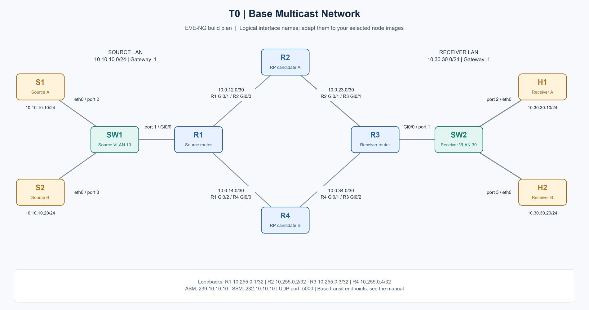

[Editable SVG](../images/14-Lab-Manual/t0-topology.svg)

This topology provides two routed paths between the source and receiver LANs. R2 and R4 can be used for RP comparison and redundancy experiments. Router roles can change between labs.

### Base Connection Table

| Connection | Endpoint A | Endpoint B |
|---|---|---|
| Source A access | S1 eth0 | SW1 port 2 |
| Source B access | S2 eth0 | SW1 port 3 |
| Source gateway | SW1 port 1 | R1 Gi0/0 |
| Upper path, first link | R1 Gi0/1 | R2 Gi0/0 |
| Upper path, second link | R2 Gi0/1 | R3 Gi0/1 |
| Lower path, first link | R1 Gi0/2 | R4 Gi0/0 |
| Lower path, second link | R4 Gi0/1 | R3 Gi0/2 |
| Receiver gateway | R3 Gi0/0 | SW2 port 1 |
| Receiver A access | SW2 port 2 | H1 eth0 |
| Receiver B access | SW2 port 3 | H2 eth0 |

### Suggested Address Plan

These addresses identify the lab devices and traffic. Enter the actual device settings yourself.

| Segment | Subnet | Device addresses |
|---|---|---|
| Source LAN / VLAN 10 | 10.10.10.0/24 | R1 .1; S1 .10; S2 .20 |
| Receiver LAN / VLAN 30 | 10.30.30.0/24 | R3 .1; H1 .10; H2 .20 |
| R1-R2 | 10.0.12.0/30 | R1 .1; R2 .2 |
| R2-R3 | 10.0.23.0/30 | R2 .1; R3 .2 |
| R1-R4 | 10.0.14.0/30 | R1 .1; R4 .2 |
| R4-R3 | 10.0.34.0/30 | R4 .1; R3 .2 |
| Router loopbacks | Individual /32 addresses | R1 10.255.0.1; R2 .2; R3 .3; R4 .4 |
| Shared Anycast RP identity | 10.255.255.254/32 | Reserved for the Anycast RP labs |

| Traffic purpose | Suggested identity |
|---|---|
| ASM group A | 239.10.10.10 |
| ASM group B | 239.10.10.11 |
| SSM group | 232.10.10.10 |
| BIDIR group | 239.20.20.20 |
| MAC mapping comparison | 239.1.1.1 and 239.129.1.1 |
| Application UDP port | 5000 |

### T1 - Single-LAN Membership and Snooping

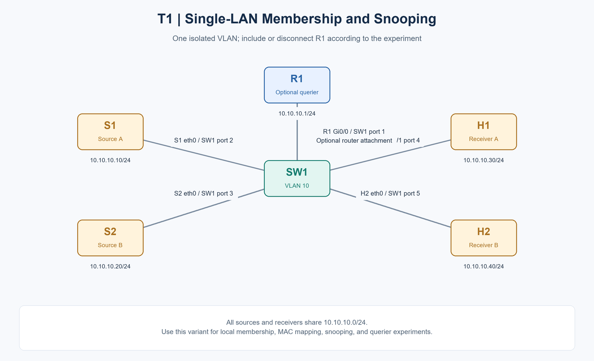

[Editable SVG](../images/14-Lab-Manual/t1-topology.svg)

Attach S1, S2, H1, and H2 to SW1 in one isolated VLAN. Keep one router attached when the experiment requires a multicast router or router-based querier. For a switch-only querier experiment, disconnect that router.

Use temporary host addresses from 10.10.10.0/24: S1 .10, S2 .20, H1 .30, and H2 .40. Return the receivers to their original locations and addresses before resuming T0.

**Use for:** MAC mapping, IGMP versions, local delivery, snooping, unknown multicast, and switch-only querier experiments.

### T2 - Two Routers on the Receiver LAN

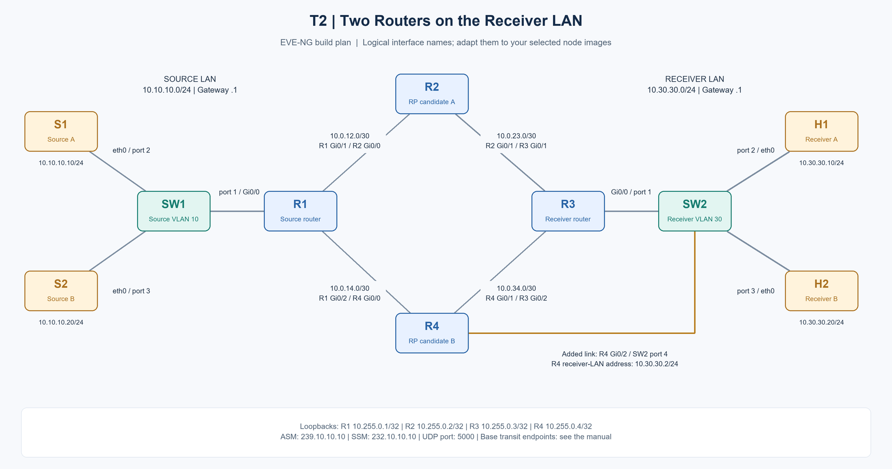

[Editable SVG](../images/14-Lab-Manual/t2-topology.svg)

Add a connection from R4 Gi0/2 to SW2 port 4. Both R3 and R4 now attach to VLAN 30. Reserve 10.30.30.2 for R4 on this LAN. Keep the other T0 connections.

**Use for:** querier election, PIM DR election, and first-hop gateway role comparisons.

### T3 - Shared Transit LAN

Add SW3 and replace the R2-R3 and R4-R3 links with one shared transit VLAN. Keep R1-R2 and R1-R4.

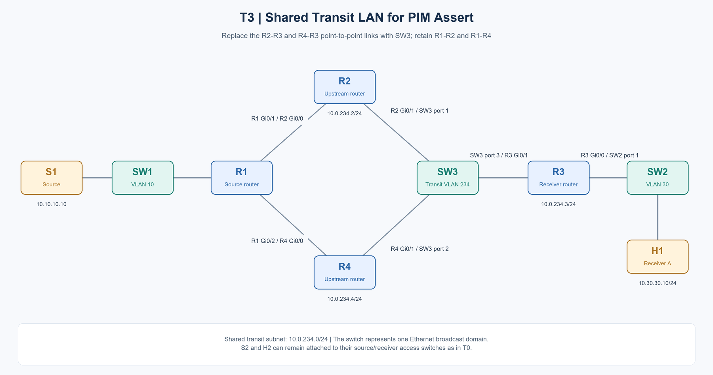

[Editable SVG](../images/14-Lab-Manual/t3-topology.svg)

| Node | Interface to SW3 | Suggested address |
|---|---|---|
| R2 | Gi0/1 | 10.0.234.2/24 |
| R3 | Gi0/1 | 10.0.234.3/24 |
| R4 | Gi0/1 | 10.0.234.4/24 |

**Use for:** PIM Assert and shared-medium forwarding experiments. Restore the point-to-point connections when returning to T0.

### T4 - Independent Receiver Branch

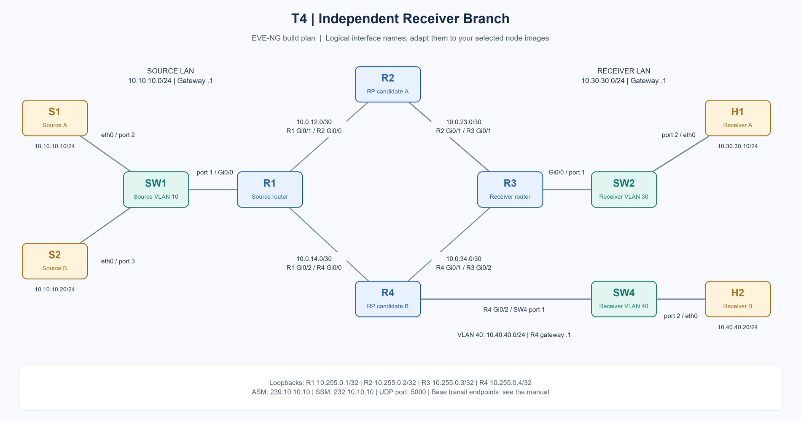

[Editable SVG](../images/14-Lab-Manual/t4-topology.svg)

Move H2 from SW2 to a new SW4 connected to R4 Gi0/2. Reserve VLAN 40 and subnet 10.40.40.0/24, with R4 .1 and H2 .20.

**Use for:** independent branches, Join/Prune propagation, RP selection, and failure isolation. T2 and T4 are separate topology variants; do not reuse R4 Gi0/2 for both at the same time.

### T5 - Multiple Receivers Behind One Switch Port

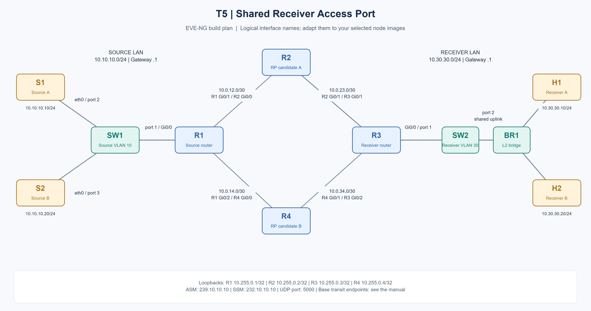

[Editable SVG](../images/14-Lab-Manual/t5-topology.svg)

Place an additional Layer 2 bridge between SW2 port 2 and both H1 and H2. Both receivers remain in VLAN 30 and share one upstream switch port.

**Use for:** leave processing, immediate leave, receiver tracking, and downstream switch behavior.

### T6 - IPv6 Variant

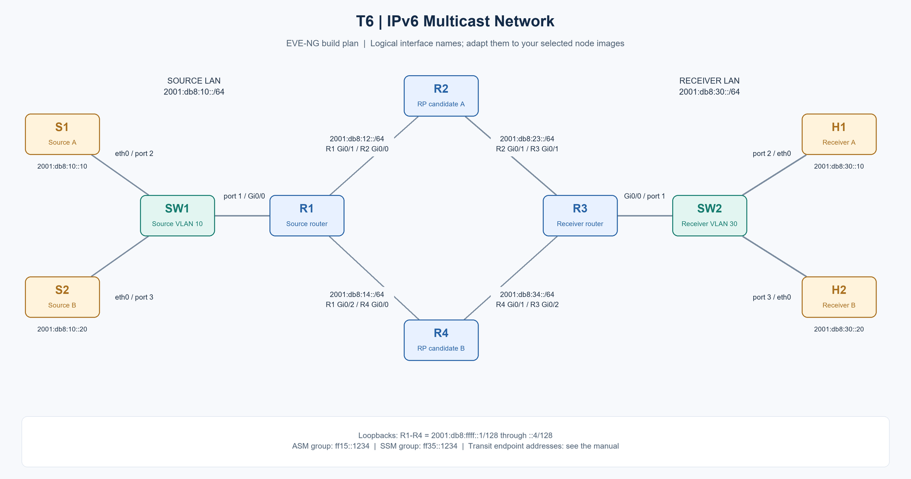

[Editable SVG](../images/14-Lab-Manual/t6-topology.svg)

Reuse T0 and add the following IPv6 address plan. Keep link-local addresses available for protocol observation.

| Segment | IPv6 prefix / addresses |
|---|---|
| Source LAN | 2001:db8:10::/64; R1 ::1, S1 ::10, S2 ::20 |
| Receiver LAN | 2001:db8:30::/64; R3 ::1, H1 ::10, H2 ::20 |
| R1-R2 | 2001:db8:12::/64; R1 ::1, R2 ::2 |
| R2-R3 | 2001:db8:23::/64; R2 ::1, R3 ::2 |
| R1-R4 | 2001:db8:14::/64; R1 ::1, R4 ::2 |
| R4-R3 | 2001:db8:34::/64; R4 ::1, R3 ::2 |
| Router loopbacks | 2001:db8:ffff::1/128 through ::4/128 |
| ASM test group | ff15::1234 |
| SSM test group | ff35::1234 |

**Use for:** IPv6 multicast addressing, MLD, IPv6 PIM, ASM, SSM, and scope experiments.

### Advanced Topology Extensions

Build these as separate EVE-NG labs so their roles and addressing remain clear.

| Topology | Nodes and connections | Purpose |
|---|---|---|
| T7 - Interdomain | S1 - DR-A - RP-A/Border-A - RP-B/Border-B - DR-B - H1 | Two PIM domains, separate RPs, and a domain boundary |
| T8 - Provider VPN | S1 - CE1 - PE1 - P - PE2 - CE2 - H1 | Customer multicast over a provider VPN |
| T9 - VXLAN/EVPN | S1 - Leaf1/VTEP1 - Spine1 - Leaf2/VTEP2 - H1 | Overlay membership and underlay replication |
| T10 - Proxy edge | S1 - upstream router - two-interface proxy - access switch - H1/H2 | Upstream/downstream membership aggregation |

Add redundant provider or fabric nodes only when testing their failure behavior. Record the image-specific prerequisites before attempting MVPN, EVPN, BIDIR, or alternative Anycast RP mechanisms.

#### T7 - Interdomain Multicast

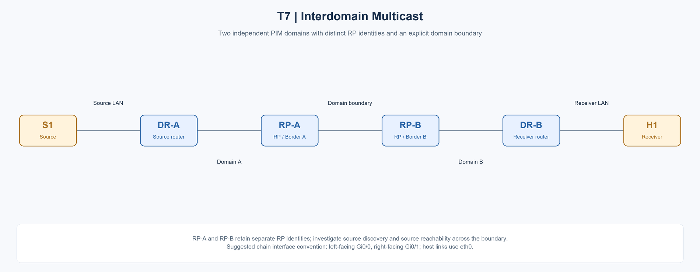

[Editable SVG](../images/14-Lab-Manual/t7-topology.svg)

#### T8 - Provider Multicast VPN

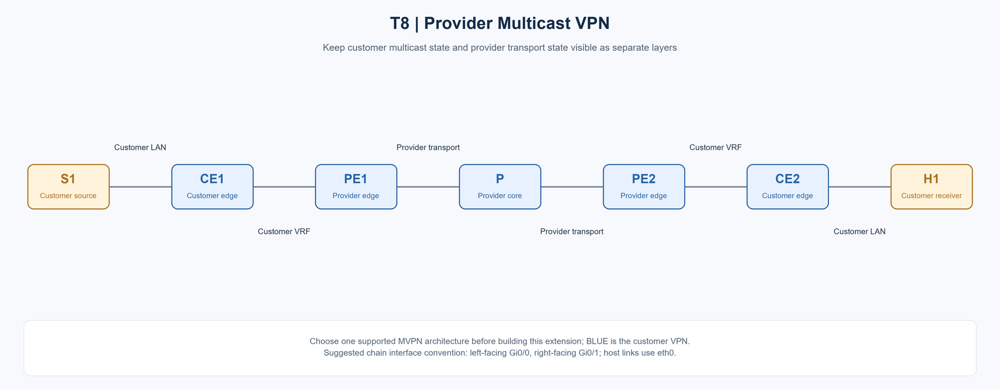

[Editable SVG](../images/14-Lab-Manual/t8-topology.svg)

#### T9 - VXLAN / EVPN Fabric

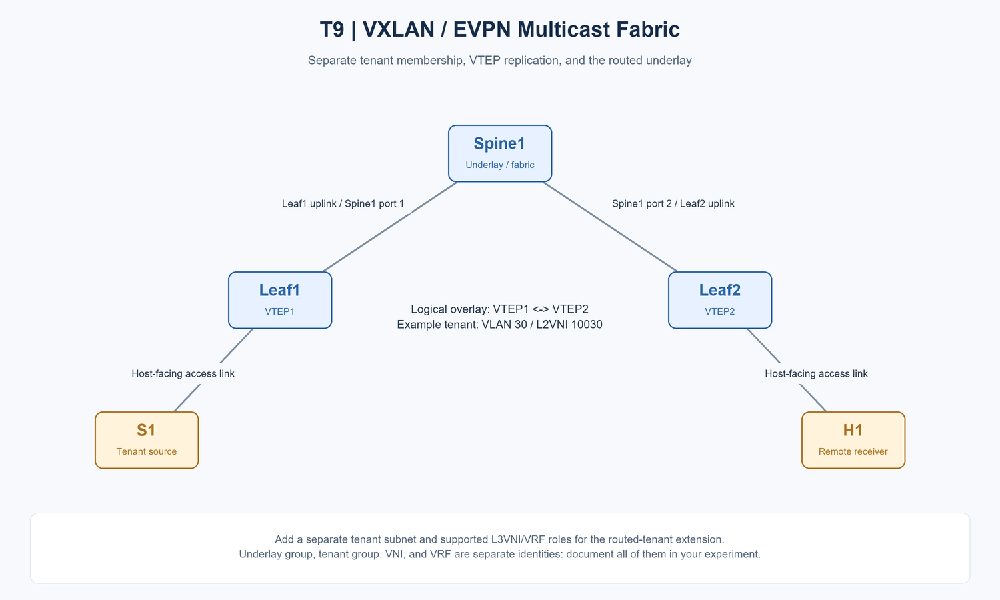

[Editable SVG](../images/14-Lab-Manual/t9-topology.svg)

#### T10 - IGMP Proxy Edge

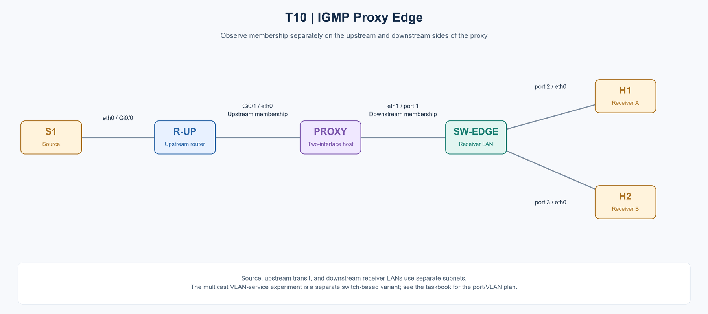

[Editable SVG](../images/14-Lab-Manual/t10-topology.svg)

### EVE-NG Build Milestones

- [ ] Create T0 and label all nodes, links, VLANs, and subnets.
- [ ] Record each node image, interface mapping, and allocated resources.
- [ ] Confirm that every intended link connects the correct interfaces.
- [ ] Complete your own baseline device and host setup.
- [ ] Save a clean copy of the baseline EVE-NG lab before individual experiments.
- [ ] Create separate saved variants for T1-T6 as needed.
- [ ] Use EVE-NG link captures to collect protocol and data-plane evidence.
- [ ] Record unsupported features instead of marking the corresponding experiment complete.

**Topology overview screenshot:**

> Add your EVE-NG topology screenshot here.

**Node/image and interface notes:**

> Add your environment details here.

## How to Complete the Experiments

### Preparation and Learning Order

1. Build T0 and record the actual interface mapping before starting protocol experiments.
2. Complete the Layer 2 and host-membership track first. Save working copies of the topology variants.
3. Establish your own unicast baseline before the routed experiments. Keep enough independent reachability evidence to diagnose later multicast failures.
4. Complete static-RP ASM and native SSM before the RP redundancy and advanced forwarding tracks.
5. Run each RP discovery or forwarding model in its own saved lab copy so earlier experiments do not silently affect later results.
6. Complete IPv6 and advanced integration only after confirming the selected images support the required features.
7. Finish with the design acceptance and blind troubleshooting assessments.

### Required Deliverables for Every Lab

- A screenshot of your EVE-NG build matching the supplied drawing, with any changes clearly identified.
- A short record of the flow under test: source, group, application port, receiver, VLAN, routing context, and membership mode.
- Your implementation notes, including any decisions you made independently.
- Screenshots or packet captures that demonstrate the objective, rather than only a device setup screen.
- Your explanation of observed behavior and, where applicable, the failure cause and retest result.
- A completion status: **Not started**, **In progress**, **Completed**, or **Not tested - prerequisite unavailable**.

Save screenshots in `../images/14-Lab-Manual/`, the shared image folder for this chapter, when you are ready to add them. A practical naming pattern is `lab-01-topology.png`, `lab-01-capture-01.png`, and `lab-01-result.png`. Replace each screenshot placeholder with your actual image links. No image filenames are linked in advance.

### Measurement Rules

Use a repeatable flow and change one test condition at a time. Record packet size, offered rate, test duration, and relevant timer settings when comparing results. For failure tests, identify the time of failure, first observed service impact, and recovery. Distinguish virtual-lab observations from conclusions that would require physical forwarding hardware.

## Track A - Fundamentals and Layer 2

### Lab 01 - Multicast Delivery and Replication

**Topology:** T0; compare with T1.

**Experiment objectives:**

- Compare delivery to zero, one, and two interested receivers.
- Identify where packet replication occurs and how receiver count affects each link.
- Distinguish source transmission, network forwarding, and application reception.

**Tasks to complete:**

1. Run the same stream with no receivers, H1 only, and H1 plus H2; keep the source rate unchanged.
2. Record packet counts at the source, one shared transit link, and both receiver access links.
3. Stop each receiver independently and draw the resulting distribution path.

**Completion criterion:** A comparison table explains the observed replication at every selected observation point.

**Suggested screenshots:** Topology, source traffic, shared-link traffic, and both receiver observations.

> Add your screenshots here.

**My observations and conclusions:**

> Complete after the experiment.

### Lab 02 - Multicast Addressing, Scope, and TTL

**Topology:** T0 and T1.

**Experiment objectives:**

- Compare multicast address categories and their intended scope.
- Investigate how TTL affects delivery across the routed topology.
- Distinguish address scope from an explicitly enforced forwarding boundary.

**Tasks to complete:**

1. Prepare a table of the group ranges you intend to compare and the receiver locations for each test.
2. Repeat one routed flow with at least three TTL values, including a value that cannot reach the remote receiver.
3. Test a local-scope group on a single LAN and compare it with an administratively scoped group across routers.

**Completion criterion:** Packet headers and receiver evidence support your explanation of scope and packet lifetime.

**Suggested screenshots:** Address plan, packet-header captures, and local versus remote reception.

> Add your screenshots here.

**My observations and conclusions:**

> Complete after the experiment.

### Lab 03 - IPv4 Multicast MAC Mapping

**Topology:** T1.

**Experiment objectives:**

- Derive Ethernet multicast addresses from selected IPv4 group addresses.
- Investigate groups that map to the same destination MAC address.
- Compare switch replication, host NIC visibility, and socket-level reception.

**Tasks to complete:**

1. Use both suggested MAC-comparison groups and one additional group of your choice.
2. Calculate the destination MACs before inspecting the captures.
3. Compare traffic visible at an unjoined port, the receiver NIC, and the application; document image limitations.

**Completion criterion:** The address calculation and all observed forwarding layers are recorded without assuming virtual and physical switches behave identically.

**Suggested screenshots:** Group addresses, Ethernet headers, switch membership state, and receiver evidence.

> Add your screenshots here.

**My observations and conclusions:**

> Complete after the experiment.

### Lab 04 - IGMPv1 Membership

**Topology:** T1 with a router attached.

**Experiment objectives:**

- Observe membership establishment and periodic maintenance using IGMPv1.
- Investigate how membership is removed when a receiver disappears.
- Compare a single receiver with multiple receivers on the same LAN.

**Tasks to complete:**

1. Use a v1-capable host and router combination and capture from before the first join.
2. Repeat membership tests with one receiver and then two receivers.
3. Compare application exit with link disconnection and measure the interval until membership disappears.

**Completion criterion:** Your evidence identifies the signaling version and accounts for membership creation, refresh, and removal.

**Suggested screenshots:** Join and query captures, membership state, and an aging timeline.

> Add your screenshots here.

**My observations and conclusions:**

> Complete after the experiment.

### Lab 05 - IGMPv2 Join and Leave

**Topology:** T1 with a router attached.

**Experiment objectives:**

- Observe IGMPv2 report, query, and leave exchanges.
- Investigate last-member processing when one receiver leaves.
- Compare graceful application exit with an unexpected receiver disconnect.

**Tasks to complete:**

1. Capture a full join, steady-state query, and leave sequence.
2. Keep H2 active while H1 leaves, then reverse the receiver roles.
3. Repeat after an unexpected host disconnect and compare removal timing.

**Completion criterion:** Both leave methods and the remaining receiver's service are documented.

**Suggested screenshots:** Membership captures, last-member activity, and the remaining receiver observation.

> Add your screenshots here.

**My observations and conclusions:**

> Complete after the experiment.

### Lab 06 - IGMPv3 Source Filtering

**Topology:** T0 with S1 and S2 active.

**Experiment objectives:**

- Compare INCLUDE and EXCLUDE membership requests.
- Investigate empty source lists, source-list changes, and membership aggregation.
- Relate application subscriptions to reports and actual received sources.

**Tasks to complete:**

1. Send from S1 and S2 to the same group and test INCLUDE, EXCLUDE, and empty-list behavior using a capable receiver.
2. Change a source list during an active experiment and capture both current-state and state-change records.
3. Run two receiver applications with different source interests and compare socket-level and LAN-level observations.

**Completion criterion:** A source-selection matrix and captured group records explain every tested subscription.

**Suggested screenshots:** Source-filter requests, IGMPv3 group records, and per-source application evidence.

> Add your screenshots here.

**My observations and conclusions:**

> Complete after the experiment.

### Lab 07 - Querier Election and Version Compatibility

**Topology:** T2.

**Experiment objectives:**

- Identify the elected querier and investigate election and takeover behavior.
- Measure membership and election timing using your chosen settings.
- Observe the effects of mixed IGMP versions on source-specific subscriptions.

**Tasks to complete:**

1. Place R3 and R4 on the same receiver LAN and identify the active querier from captures.
2. Fail the active querier and measure takeover and receiver continuity.
3. Repeat with mixed IGMP versions and compare the source-specific receiver behavior.

**Completion criterion:** Election timing, active versions, and application impact are recorded separately.

**Suggested screenshots:** Both routers, query-source captures, version observations, and a failover timeline.

> Add your screenshots here.

**My observations and conclusions:**

> Complete after the experiment.

### Lab 08 - IGMP Snooping and Unknown Multicast

**Topology:** T1 and T0.

**Experiment objectives:**

- Observe how a switch learns and removes multicast member ports.
- Compare forwarding for known and unknown multicast groups.
- Investigate report suppression and the difference between group state and receiver count.

**Tasks to complete:**

1. Join only H1, then add H2, then remove both while recording port membership.
2. Compare known-group and never-joined-group forwarding to an unused access port.
3. Repeat one case with snooping behavior changed and compare upstream reports with local receiver count.

**Completion criterion:** A port-by-port forwarding table covers the tested membership states.

**Suggested screenshots:** Switch group state, joined and unjoined port captures, and membership transitions.

> Add your screenshots here.

**My observations and conclusions:**

> Complete after the experiment.

### Lab 09 - Snooping Querier and Mrouter Ports

**Topology:** T1; test router-attached and switch-only variants separately.

**Experiment objectives:**

- Identify the role of a querier in maintaining Layer 2 multicast state.
- Investigate dynamic and static multicast-router port behavior.
- Observe membership and traffic behavior when queries or the upstream report path disappear.

**Tasks to complete:**

1. Test the same Layer 2 stream with a router-based querier and a supported switch-based querier in separate runs.
2. Observe forwarding for longer than the measured aging interval after queries disappear.
3. Compare dynamic mrouter learning with a deliberately chosen static mrouter port and investigate an incorrect upstream path.

**Completion criterion:** The report path, state lifetime, and resulting delivery behavior are supported by captures.

**Suggested screenshots:** Querier state, mrouter-port state, upstream reports, and observations over time.

> Add your screenshots here.

**My observations and conclusions:**

> Complete after the experiment.

### Lab 10 - Immediate Leave and Shared Receiver Ports

**Topology:** T5.

**Experiment objectives:**

- Compare normal leave processing with immediate-leave behavior.
- Investigate the effect of one receiver leaving while another remains behind the same port.
- Assess when receiver tracking is needed for the topology.

**Tasks to complete:**

1. Put both receivers behind the same upstream switch port and establish a common membership.
2. Compare normal and immediate-leave modes while stopping only one receiver.
3. Repeat using a supported receiver-tracking feature if available and document its impact.

**Completion criterion:** Your results establish whether the remaining receiver stays served in each tested mode.

**Suggested screenshots:** Shared-port topology, leave captures, switch state, and the second receiver timeline.

> Add your screenshots here.

**My observations and conclusions:**

> Complete after the experiment.

## Track B - Multicast Routing and PIM

### Lab 11 - PIM Neighbors and DR Election

**Topology:** T0, followed by T2.

**Experiment objectives:**

- Observe PIM neighbor discovery, maintenance, and timeout behavior.
- Investigate PIM DR election and failover on a shared LAN.
- Compare the DR, IGMP querier, and default-gateway roles.

**Tasks to complete:**

1. Record PIM adjacency formation on each transit link and capture the relevant exchanges.
2. On T2, change the factors involved in DR selection and record the chosen DR.
3. Fail the selected DR and compare its recovery with querier and gateway behavior.

**Completion criterion:** Adjacency maintenance and the three LAN roles are supported by separate evidence.

**Suggested screenshots:** Neighbor state, Hello captures, elected roles, and failover evidence.

> Add your screenshots here.

**My observations and conclusions:**

> Complete after the experiment.

### Lab 12 - ASM with a Static RP

**Topology:** T0 with R2 as the initial RP.

**Experiment objectives:**

- Build an ASM service between S1 and H1 using your own configuration.
- Trace receiver interest and source activity through the topology.
- Compare receiver-first and source-first startup.

**Tasks to complete:**

1. Choose a unicast routing design and establish an ASM service with R2 as the static RP.
2. Run receiver-first and source-first tests on different fresh groups.
3. Draw the control-message path and the observed data path for each startup order.

**Completion criterion:** A receiver obtains the intended stream and the startup observations are documented end to end.

**Suggested screenshots:** Topology, RP mapping, membership, tree state, and receiver traffic.

> Add your screenshots here.

**My observations and conclusions:**

> Complete after the experiment.

### Lab 13 - Register and Register-Stop

**Topology:** T0.

**Experiment objectives:**

- Observe source registration and the transition between encapsulated and native traffic.
- Investigate Register-Stop and subsequent registration maintenance.
- Compare source discovery for a new flow with behavior of an established flow.

**Tasks to complete:**

1. Begin captures before introducing a previously unused source/group.
2. Compare startup with an active receiver and startup without one, then continue through steady state.
3. Introduce a registration-path fault of your choice and compare fresh flows with already running flows.

**Completion criterion:** The captured exchanges and your independent diagnosis account for both normal and failed startup.

**Suggested screenshots:** Registration captures, RP/source-router state, and a startup timeline.

> Add your screenshots here.

**My observations and conclusions:**

> Complete after the experiment.

### Lab 14 - Shared Tree and Shortest-Path Tree

**Topology:** T0 with distinguishable source and RP paths.

**Experiment objectives:**

- Observe shared-tree forwarding and a transition to a source tree.
- Relate route choices to the actual incoming data path.
- Investigate tree policy effects, pruning, and transition-related packet behavior.

**Tasks to complete:**

1. Make the RP path and preferred source path distinguishable in the topology.
2. Compare a shared-tree retention policy with a source-tree transition policy.
3. Capture both candidate paths throughout the transition and record any gap, duplication, or reordering.

**Completion criterion:** Your tree diagrams match the observed data path before, during, and after the transition.

**Suggested screenshots:** Before/after tree state, captures on both paths, and receiver sequence observations.

> Add your screenshots here.

**My observations and conclusions:**

> Complete after the experiment.

### Lab 15 - Reverse Path Forwarding

**Topology:** T0.

**Experiment objectives:**

- Identify the lookup and incoming-interface decisions used for multicast RPF.
- Compare unicast routing information with multicast-specific routing information.
- Create and diagnose an RPF-related forwarding failure.

**Tasks to complete:**

1. Record the source and RP routing decisions at each router for a working flow.
2. Introduce a multicast RPF inconsistency while retaining useful unicast reachability.
3. Locate the failing hop, explain it using your evidence, and restore delivery.

**Completion criterion:** The diagnosis identifies the relevant lookup target, selected incoming interface, and actual packet arrival interface.

**Suggested screenshots:** Routing decisions, multicast state, and captures around the failing hop.

> Add your screenshots here.

**My observations and conclusions:**

> Complete after the experiment.

### Lab 16 - ECMP, Asymmetry, and Path Failure

**Topology:** T0.

**Experiment objectives:**

- Investigate multicast path selection when more than one underlay path is available.
- Compare equal-cost paths with unequal-cost and asymmetric paths.
- Measure forwarding recovery after failure of the selected path.

**Tasks to complete:**

1. Create equal-cost and unequal-cost alternatives and compare the selected multicast path.
2. Repeat with multiple channels to investigate the image's path-selection behavior.
3. Fail the selected link, measure recovery, and repeat after restoring it.

**Completion criterion:** Your results distinguish available unicast paths from the actual multicast forwarding path.

**Suggested screenshots:** Route alternatives, selected incoming interface, and a packet-loss/recovery timeline.

> Add your screenshots here.

**My observations and conclusions:**

> Complete after the experiment.

### Lab 17 - Incoming Interfaces, Outgoing Interfaces, and Join/Prune

**Topology:** T4.

**Experiment objectives:**

- Draw the distribution tree for two receivers on independent branches.
- Trace state changes when each receiver joins and leaves.
- Investigate branch-specific failures while another receiver remains active.

**Tasks to complete:**

1. Place H1 and H2 on independent receiver branches and join both to one stream.
2. Record each router's incoming interface and outgoing interface list as receivers join and leave.
3. Create a failure affecting only one branch, diagnose it, and retest both receivers.

**Completion criterion:** A sequence of tree diagrams accounts for each branch and state transition.

**Suggested screenshots:** Per-router tree state, Join/Prune captures, and both receiver results.

> Add your screenshots here.

**My observations and conclusions:**

> Complete after the experiment.

### Lab 18 - PIM Assert

**Topology:** T3.

**Experiment objectives:**

- Create a shared-LAN condition in which multiple routers attempt forwarding.
- Observe Assert exchange and investigate selection of the forwarding router.
- Compare Assert, DR election, and behavior after a metric or link change.

**Tasks to complete:**

1. Use the shared transit LAN and arrange a test where more than one upstream router attempts delivery onto it.
2. Capture the resulting control exchange and determine the winning forwarder from your observations.
3. Change a relevant route metric or fail the forwarder and repeat the experiment.

**Completion criterion:** The experiment includes an observed Assert exchange, a justified winner, and post-change delivery evidence.

**Suggested screenshots:** Shared-LAN topology, Assert captures, forwarding state, and duplicate-packet observations.

> Add your screenshots here.

**My observations and conclusions:**

> Complete after the experiment.

### Lab 19 - Native Source-Specific Multicast

**Topology:** T0 with S1 and S2.

**Experiment objectives:**

- Build a source-specific channel using a receiver application that requests the source.
- Compare ASM and SSM control-plane dependencies.
- Investigate delivery when two sources use the same group address.

**Tasks to complete:**

1. Build a native source-specific subscription for S1 and verify the requested source in the host signaling.
2. Introduce S2 using the same group and compare what each receiver socket obtains.
3. Compare operation with and without ASM RP availability, using a fresh channel for each test.

**Completion criterion:** Source-selection and RP-dependency conclusions are supported by fresh-channel tests.

**Suggested screenshots:** Receiver subscription, source-specific reports, source-tree state, and received source identities.

> Add your screenshots here.

**My observations and conclusions:**

> Complete after the experiment.

### Lab 20 - SSM Mapping and Static Membership

**Topology:** T0.

**Experiment objectives:**

- Investigate how a legacy group-only receiver can be associated with a source.
- Compare application membership, router-local membership, and static forwarding interest.
- Assess how incorrect or lingering membership policy affects troubleshooting.

**Tasks to complete:**

1. Use a legacy group-only receiver with your own source-mapping policy.
2. Change the mapped source and compare the requested group with the resulting channel.
3. Separately compare a real host join, router-local membership, and static forwarding interest, then remove each test state.

**Completion criterion:** The report distinguishes how each membership type is created and what it proves about actual host reception.

**Suggested screenshots:** Membership policy, resulting source/group state, switch-port evidence, and host observations.

> Add your screenshots here.

**My observations and conclusions:**

> Complete after the experiment.

## Track C - RP Discovery and Redundancy

### Lab 21 - RP Mapping Scope and Consistency

**Topology:** T0.

**Experiment objectives:**

- Assign different group ranges to RP candidates and investigate mapping selection.
- Compare unmapped groups with inconsistent mappings across routers.
- Assess new-group behavior separately from established traffic.

**Tasks to complete:**

1. Create at least two group ranges and assign their RP roles explicitly.
2. Test an unmapped group and a group with deliberately inconsistent mappings.
3. Correct your design and compare the behavior of fresh and previously established flows.

**Completion criterion:** The group-to-RP plan and independent diagnosis cover both mapping failures.

**Suggested screenshots:** Per-router group-to-RP mappings and new versus existing flow observations.

> Add your screenshots here.

**My observations and conclusions:**

> Complete after the experiment.

### Lab 22 - Bootstrap Router and Candidate RP Selection

**Topology:** T0 with R2 and R4 as candidates.

**Experiment objectives:**

- Observe BSR election, candidate-RP advertisement, and group-to-RP selection.
- Distinguish the BSR role from the RP forwarding role.
- Measure response to loss of the BSR and loss of an RP in separate experiments.

**Tasks to complete:**

1. Use two BSR candidates and two RP candidates, documenting each selection parameter.
2. Observe the stable BSR and RP mappings before introducing any failure.
3. Fail BSR discovery and RP service in separate runs, measuring both mapping changes and receiver behavior.

**Completion criterion:** The results distinguish discovery-role failover from RP-service failover.

**Suggested screenshots:** BSR state, RP mappings, control captures, and separate failure timelines.

> Add your screenshots here.

**My observations and conclusions:**

> Complete after the experiment.

### Lab 23 - Auto-RP Discovery

**Topology:** T0 on images supporting Auto-RP.

**Experiment objectives:**

- Observe candidate-RP announcements and mapping-agent discovery.
- Investigate reachability of discovery traffic before application trees are established.
- Assess mapping aging and behavior following discovery-path interruption.

**Tasks to complete:**

1. Assign candidate-RP and mapping-agent roles and identify their discovery traffic.
2. Test a fresh application group after learning the mapping.
3. Interrupt discovery transport and observe cached-state lifetime, fresh joins, and recovery.

**Completion criterion:** Your evidence distinguishes current discovery health from previously learned mappings.

**Suggested screenshots:** Discovery captures, mapping-agent state, learned mappings, and fresh-join observations.

> Add your screenshots here.

**My observations and conclusions:**

> Complete after the experiment.

### Lab 24 - Anycast RP with MSDP

**Topology:** T4 with R2 and R4 as RP nodes.

**Experiment objectives:**

- Build a shared RP identity while preserving distinct RP-node identities.
- Place source registration and receiver interest at different RP nodes.
- Investigate source discovery and delivery during an MSDP or RP failure.

**Tasks to complete:**

1. Place the source and a receiver so they select different RP nodes.
2. Observe source information exchanged between the RP nodes before testing an unused group.
3. Fail the source-discovery session and one RP in separate runs; include fresh joins and fresh sources in the comparison.

**Completion criterion:** Both cross-RP source discovery and RP-node failure are tested beyond an established stream.

**Suggested screenshots:** RP selection, peer/source-active state, inter-RP captures, and new-flow failover evidence.

> Add your screenshots here.

**My observations and conclusions:**

> Complete after the experiment.

### Lab 25 - PIM Anycast RP

**Topology:** T4 on images supporting this mechanism.

**Experiment objectives:**

- Investigate Anycast RP source synchronization using PIM.
- Compare its operation and dependencies with the MSDP-based experiment.
- Assess incomplete RP-set information and RP-node failure.

**Tasks to complete:**

1. Use images that support PIM-based Anycast RP and record the intended RP set.
2. Place source registration and receiver interest at different RP nodes and capture inter-RP activity.
3. Introduce an inconsistent RP-set entry, then separately test RP-node failure.

**Completion criterion:** The mechanism, its difference from the MSDP experiment, and your fault diagnosis are documented.

**Suggested screenshots:** RP membership plan, inter-RP captures, fresh-source delivery, and failure observations.

> Add your screenshots here.

**My observations and conclusions:**

> Complete after the experiment.

## Track D - IPv6 and Additional Forwarding Models

### Lab 26 - PIM Dense Mode

**Topology:** T0 on images supporting PIM-DM.

**Experiment objectives:**

- Observe initial forwarding and the subsequent evolution of distribution state.
- Investigate receiver arrival after a branch has lost interest.
- Compare state, traffic overhead, and recovery behavior with sparse mode.

**Tasks to complete:**

1. Start a stream without any interested receiver and capture its initial and later distribution.
2. Add a receiver after the distribution state has changed, then remove it again.
3. Compare the observed control exchanges and link load with your sparse-mode experiment.

**Completion criterion:** Your timeline covers initial forwarding, state removal, and renewed receiver interest.

**Suggested screenshots:** Initial and steady-state captures, tree state, and receiver join/leave timelines.

> Add your screenshots here.

**My observations and conclusions:**

> Complete after the experiment.

### Lab 27 - Bidirectional PIM

**Topology:** T0 or T4 with sources on more than one LAN.

**Experiment objectives:**

- Build a many-to-many multicast experiment using BIDIR.
- Observe shared-tree forwarding and designated-forwarder behavior.
- Investigate RP-path failure and compare supported redundancy designs.

**Tasks to complete:**

1. Place senders and receivers on at least two LANs and select one BIDIR group.
2. Observe designated-forwarder decisions and traffic moving through the shared tree.
3. Change RP-path reachability and test a supported redundancy design if available.

**Completion criterion:** Bidirectional delivery, DF decisions, and the chosen failure experiment have supporting evidence.

**Suggested screenshots:** Source/receiver placement, DF state, tree captures, and path-failure results.

> Add your screenshots here.

**My observations and conclusions:**

> Complete after the experiment.

### Lab 28 - IPv6 Addressing and MLD

**Topology:** T6; use a single-LAN variant for local membership tests.

**Experiment objectives:**

- Investigate IPv6 multicast scope and Ethernet address mapping.
- Compare MLDv1 and MLDv2 membership behavior.
- Observe MLD snooping, querier behavior, source filtering, and membership aging.

**Tasks to complete:**

1. Compare IPv6 group scopes and derive the associated Ethernet multicast addresses.
2. Run separate MLDv1 and MLDv2 membership experiments with a capable receiver.
3. Investigate query election, snooping, aging, and source-filter behavior using a receiver-LAN variant of T6.

**Completion criterion:** The report includes IPv6-specific membership and packet-header evidence rather than inferring success from IPv4.

**Suggested screenshots:** IPv6 address plan, MLD captures, switch state, and scope comparisons.

> Add your screenshots here.

**My observations and conclusions:**

> Complete after the experiment.

### Lab 29 - IPv6 ASM, SSM, and RP Discovery

**Topology:** T6.

**Experiment objectives:**

- Build routed IPv6 ASM and source-specific delivery as separate experiments.
- Trace IPv6 membership, PIM state, RPF selection, and data forwarding.
- Explore supported RP discovery and embedded-RP behavior, and diagnose an IPv6-only failure.

**Tasks to complete:**

1. Establish IPv6 underlay reachability and test routed ASM and native SSM separately.
2. Compare the observed RP and source-tree dependencies; add a supported embedded-RP experiment if available.
3. Introduce an IPv6-only membership or RPF fault while retaining an IPv4 working comparison.

**Completion criterion:** The IPv6 packet path, actual source-specific subscription, and independently diagnosed failure are documented.

**Suggested screenshots:** IPv6 topology, memberships, RP/source-tree state, packet path, and failure evidence.

> Add your screenshots here.

**My observations and conclusions:**

> Complete after the experiment.

### Lab 30 - VRF-Lite and Multicast Isolation

**Topology:** Separate copies of T0 in BLUE and RED routing contexts.

**Experiment objectives:**

- Build independent multicast services using separate routing contexts.
- Investigate reuse of group and source identities without cross-context delivery.
- Assess route, RP, and membership context when diagnosing isolation failures.

**Tasks to complete:**

1. Build two independent routing contexts with a clear interface and addressing plan.
2. Reuse selected group/source identities and test delivery inside and across the intended isolation boundary.
3. Introduce a routing-context mismatch, locate it, and verify isolation after repair.

**Completion criterion:** Both permitted delivery and absence of unintended cross-context delivery are demonstrated.

**Suggested screenshots:** VRF/interface plan, per-context state, and positive/negative isolation tests.

> Add your screenshots here.

**My observations and conclusions:**

> Complete after the experiment.

### Lab 31 - Multicast over a Tunnel

**Topology:** T0 with a logical tunnel between R1 and R3.

**Experiment objectives:**

- Build multicast delivery over a transit that carries the chosen unicast encapsulation.
- Relate tunnel reachability, multicast RPF, and the inner and outer packet paths.
- Investigate the effects of tunnel failure and encapsulation overhead.

**Tasks to complete:**

1. Document the physical underlay and logical multicast transport as separate diagrams.
2. Establish a flow across the tunnel and capture inner and outer traffic.
3. Compare behavior after a tunnel failure and after changing the usable packet size.

**Completion criterion:** Your evidence relates endpoint reachability, tree selection, encapsulation, and receiver delivery.

**Suggested screenshots:** Physical/logical topology, inner/outer captures, forwarding state, and tunnel-failure observations.

> Add your screenshots here.

**My observations and conclusions:**

> Complete after the experiment.

## Track E - Security, Performance, and Design

### Lab 32 - Administrative Boundaries and Admission Control

**Topology:** T4.

**Experiment objectives:**

- Define which groups and receivers are allowed at each site.
- Investigate group boundaries, receiver admission, and source restrictions separately.
- Verify permitted delivery and denied delivery, including alternate paths.

**Tasks to complete:**

1. Write an allow/deny matrix for groups, sources, receiver sites, and boundaries before implementing it.
2. Test boundary policy, receiver admission, and source restrictions independently.
3. Repeat the positive and negative tests after a path change and investigate any unintended delivery.

**Completion criterion:** Every policy intent has both an appropriate success test and a rejection test.

**Suggested screenshots:** Policy intent table, relevant state, and allowed/denied receiver evidence.

> Add your screenshots here.

**My observations and conclusions:**

> Complete after the experiment.

### Lab 33 - Control-Plane Protection and State Limits

**Topology:** T0 using bounded traffic and membership loads.

**Experiment objectives:**

- Investigate how multicast control traffic competes for device processing resources.
- Assess membership limits and controlled join/leave bursts.
- Compare control-plane disruption with direct data-plane filtering.

**Tasks to complete:**

1. Choose a small, bounded set of group counts and join/leave rates appropriate to your images.
2. Observe resource and state behavior before and after applying your chosen limits or protection policy.
3. Create a controlled protection-policy failure and assess service recovery after correcting it.

**Completion criterion:** Measured load, limits, rejected activity, and legitimate receiver impact are recorded.

**Suggested screenshots:** Load plan, state counts, resource/drop observations, and recovery timeline.

> Add your screenshots here.

**My observations and conclusions:**

> Complete after the experiment.

### Lab 34 - Packet Size, MTU, and Fragmentation

**Topology:** T0, followed by the tunnel variant.

**Experiment objectives:**

- Measure delivery across a range of application packet sizes.
- Investigate fragmentation, reassembly, and encapsulation-related MTU changes.
- Compare IPv4 and IPv6 failure behavior for packets exceeding the usable path MTU.

**Tasks to complete:**

1. Prepare a packet-size test matrix for native IPv4, tunneled IPv4, and IPv6 where supported.
2. Identify the largest reliably delivered payload in each selected path.
3. Capture and diagnose behavior above that size and repeat after your corrective change.

**Completion criterion:** The tested packet sizes, actual path overhead, and delivery results are recorded without relying only on interface MTU labels.

**Suggested screenshots:** Packet-size matrix, packet-header captures, and delivery/drop evidence.

> Add your screenshots here.

**My observations and conclusions:**

> Complete after the experiment.

### Lab 35 - Multicast QoS and Replication Cost

**Topology:** T0 and T4 with controlled competing traffic.

**Experiment objectives:**

- Investigate multicast classification, marking, queuing, shaping, and policing.
- Measure the effect of congestion on receiver delivery.
- Compare per-link and per-port load as receivers and branches are added.

**Tasks to complete:**

1. Create a controlled bottleneck and record the multicast and competing traffic rates.
2. Compare the selected QoS behaviors at the same offered load, including a deliberately incorrect classification case.
3. Repeat with one receiver, two receivers on one LAN, and receivers on separate branches.

**Completion criterion:** Rate, marking, queue/drop, and receiver evidence support the performance comparison.

**Suggested screenshots:** Traffic-rate plan, queue observations, packet markings, and receiver measurements.

> Add your screenshots here.

**My observations and conclusions:**

> Complete after the experiment.

### Lab 36 - Host Reception, Scale, and Resilience

**Topology:** T0 with Linux endpoints; extend receiver count as needed.

**Experiment objectives:**

- Distinguish network delivery from NIC, kernel, and application reception.
- Investigate group/source scale, receive-buffer pressure, and membership churn.
- Measure service recovery after source, link, RP, DR, or querier failures.

**Tasks to complete:**

1. Compare traffic observed at the network egress, receiver NIC, and receiver application.
2. Increase load or state count in bounded steps, separately testing data rate and membership churn.
3. Measure recovery for at least three distinct failure roles and state the limits of EVE-NG performance measurements.

**Completion criterion:** The report separates host loss, network loss, state limits, and measured convergence.

**Suggested screenshots:** Host/network observations, load matrix, state counts, and measured recovery results.

> Add your screenshots here.

**My observations and conclusions:**

> Complete after the experiment.

## Track F - Advanced Integration

### Lab 37 - Interdomain Multicast

**Topology:** T7.

**Experiment objectives:**

- Build multicast delivery between two separately managed PIM domains.
- Investigate source discovery, routing-policy dependencies, and multicast RPF across the boundary.
- Compare interdomain ASM and SSM and assess a discovery or route-policy failure.

**Tasks to complete:**

1. Plan two domains with distinct local RP roles and an explicit source-routing policy.
2. Establish cross-domain ASM and then compare a source-specific service.
3. Introduce a discovery-policy failure and a routing-policy failure in separate runs and diagnose both.

**Completion criterion:** Source discovery, routing information, and the actual distribution tree are traced across the domain boundary.

**Suggested screenshots:** Domain diagram, RP/source-discovery state, boundary routing, and remote-receiver evidence.

> Add your screenshots here.

**My observations and conclusions:**

> Complete after the experiment.

### Lab 38 - Multicast VPN

**Topology:** T8 on images supporting the selected MVPN model.

**Experiment objectives:**

- Map customer multicast state to the selected provider transport.
- Compare shared and selective transport behavior where supported.
- Investigate a provider multicast failure while the unicast VPN remains available.

**Tasks to complete:**

1. Choose one supported MVPN architecture and document its prerequisite unicast VPN and provider transport.
2. Trace one customer channel through both customer and provider state and captures.
3. Fail a multicast-specific transport or service dependency while retaining a useful unicast comparison.

**Completion criterion:** The customer channel is mapped to its provider transport and the independent diagnosis identifies the failed layer.

**Suggested screenshots:** Customer/provider diagrams, per-layer state, encapsulation captures, and failure evidence.

> Add your screenshots here.

**My observations and conclusions:**

> Complete after the experiment.

### Lab 39 - VXLAN/EVPN and Tenant Multicast

**Topology:** T9 on images supporting the selected fabric features.

**Experiment objectives:**

- Distinguish underlay replication, Layer 2 membership, and routed tenant multicast.
- Compare multicast underlay replication with ingress replication.
- Investigate remote membership, pruning, and failure of an outer transport dependency.

**Tasks to complete:**

1. Document the VLAN, VNI, VRF, VTEP, and replication-group relationships before testing.
2. Compare a local and a remote receiver, and compare supported underlay multicast and ingress-replication modes.
3. Add a separate routed-tenant test if supported, then diagnose a selected membership or outer-transport failure.

**Completion criterion:** Layer 2 overlay delivery, underlay replication, and routed tenant delivery are reported as distinct tests.

**Suggested screenshots:** VLAN/VNI/VRF plan, inner/outer captures, membership state, and local/remote delivery.

> Add your screenshots here.

**My observations and conclusions:**

> Complete after the experiment.

### Lab 40 - IGMP Proxy and Multicast VLAN Services

**Topology:** T10; separate switch-based variant for multicast VLAN services.

**Experiment objectives:**

- Observe aggregation of downstream receiver interest into upstream membership.
- Investigate multicast delivery between subscriber VLANs and a shared source service.
- Assess source-filter support and the effect of incorrect interface or port roles.

**Tasks to complete:**

1. Build the proxy variant and observe membership on its upstream and downstream sides.
2. In a separate supported switch topology, deliver a multicast service to receiver VLANs and test their isolation.
3. Introduce an incorrect upstream/downstream or source/receiver port role and assess source-filter capability.

**Completion criterion:** The two service models, their supported membership behavior, and the role-related fault are documented separately.

**Suggested screenshots:** Upstream/downstream topology, membership captures, VLAN roles, and receiver evidence.

> Add your screenshots here.

**My observations and conclusions:**

> Complete after the experiment.

## Track G - Troubleshooting Assessment

### Lab 41 - Multicast Service Design and Acceptance

**Topology:** T0 or T4, extended to your service requirements.

**Experiment objectives:**

- Design a two-source, two-site service with explicit availability, isolation, and performance requirements.
- Choose the multicast model and identify shared failure dependencies.
- Define measurable acceptance criteria and collect evidence for each requirement.

**Tasks to complete:**

1. Write numeric targets for join time, failover time, sustained rate, permitted sources, and isolation before building the service.
2. Implement the design using your own configuration and create a test case for every requirement.
3. Test shared dependencies and failure scenarios, then record pass, fail, or not tested with supporting evidence.

**Completion criterion:** Every requirement has a measured result or an explicit untested prerequisite, and the final design matches the evidence.

**Suggested screenshots:** Final design, requirements/test matrix, failure scenarios, and measured acceptance results.

> Add your screenshots here.

**My observations and conclusions:**

> Complete after the experiment.

### Lab 42 - Blind Troubleshooting

**Topology:** Any completed topology, starting from a known working state.

**Experiment objectives:**

- Diagnose a fault without consulting the hidden configuration change.
- Locate the first missing packet or state transition and support the diagnosis with evidence.
- Repair the identified fault, retest the service, and explain the root cause in your own words.

**Tasks to complete:**

1. Ask a partner to choose a scenario from the ticket list below, or prepare hidden changes in separate lab copies.
2. Record the symptom and a testable hypothesis before making any repair; retain the observations that confirm or reject it.
3. Complete one-fault cases first, then a two-fault case, and independently verify service recovery after your repairs.

**Completion criterion:** The final report explains the fault using decisive evidence and includes a successful post-repair retest.

**Suggested screenshots:** Reported symptom, topology, decisive observations, and before/after service evidence.

> Add your screenshots here.

**My observations and conclusions:**

> Complete after the experiment.

## Troubleshooting Ticket Scenarios

Use these as reported symptoms for Lab 42. The person preparing the fault should retain a private change record. The investigator should receive only the topology, intended service, and symptom. Choose the exact fault yourself; this workbook does not provide the diagnoses.

| Ticket | Reported symptom | My diagnosis / evidence |
|---|---|---|
| T01 | A source-LAN receiver works, but the remote receiver does not. | |
| T02 | A receiver sees packets in a capture, but its application receives nothing. | |
| T03 | One receiver fails while another receiver on the same switch works. | |
| T04 | Traffic works after a join and stops after a repeatable delay. | |
| T05 | One receiver leaving interrupts another receiver. | |
| T06 | Unicast reachability works, but multicast stops at a transit link. | |
| T07 | Existing streams work, but a new source or group cannot start. | |
| T08 | The intended group works for one source but not for the requested source. | |
| T09 | Membership is visible locally, but upstream interest is missing. | |
| T10 | Delivery fails only after a routing-path change. | |
| T11 | Duplicate packets appear on a shared transit segment. | |
| T12 | RP failure leaves old flows working but prevents new joins. | |
| T13 | Small packets work, but larger packets fail. | |
| T14 | Receiver loss appears only while competing traffic is active. | |
| T15 | Two routing contexts show different results for the same group. | |
| T16 | IPv4 multicast works, but IPv6 multicast does not. | |
| T17 | The provider unicast VPN works, but remote multicast does not. | |
| T18 | Local fabric receivers work, but remote fabric receivers do not. | |
| T19 | An unauthorized receiver or source participates in the service. | |
| T20 | A two-fault incident remains partially broken after the first repair. | |

## Personal Experiment Record

Copy this template when you want a more detailed record for an individual lab.

| Item | My record |
|---|---|
| Lab number and title | |
| Date | |
| EVE-NG lab name | |
| Node images and versions | |
| Topology variant and changes | |
| Source, group, application port | |
| Receiver and membership mode | |
| VLAN / routing context | |
| Experiment objective | |
| My implementation notes | |
| Observed behavior | |
| Fault symptom, if applicable | |
| Evidence supporting my diagnosis | |
| My corrective action | |
| Result after retesting | |
| Remaining questions | |

**Screenshots:**

> Add topology, protocol/state, packet-capture, and receiver-result screenshots as appropriate.

**My packet-path explanation:**

> Describe the path and relevant state using your own observations.

**My final conclusion:**

> State whether the objective was achieved and what remains to investigate.

## Coverage and Progress

| Knowledge area | Labs | Completed |
|---|---|---|
| Fundamentals, scope, and MAC mapping | 01-03 | [ ] |
| IGMPv1/v2/v3, timers, and compatibility | 04-07 | [ ] |
| Snooping, querier, mrouter ports, and leave behavior | 08-10 | [ ] |
| PIM adjacency, DR, ASM, and registration | 11-13 | [ ] |
| Shared/source trees, RPF, ECMP, Join/Prune, and Assert | 14-18 | [ ] |
| SSM, source mapping, and static membership | 19-20 | [ ] |
| RP selection, BSR, Auto-RP, and Anycast RP | 21-25 | [ ] |
| Dense mode, BIDIR, IPv6, and MLD | 26-29 | [ ] |
| VRF isolation and tunnel transport | 30-31 | [ ] |
| Security, QoS, MTU, scale, and resilience | 32-36 | [ ] |
| Interdomain multicast, MVPN, EVPN, and proxy services | 37-40 | [ ] |
| Design acceptance and troubleshooting | 41-42 | [ ] |

For an unsupported feature, record the missing prerequisite and leave the experiment incomplete. Additional platform-specific experiments can be added using the personal record template.
